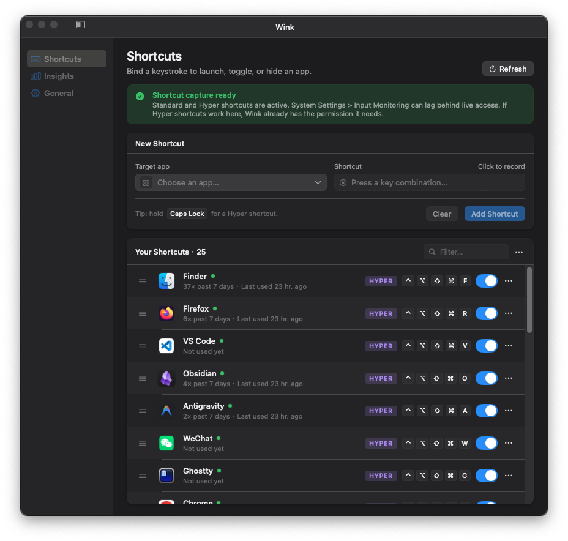

# Quickey

<p align="center">
  
</p>

Quickey is a macOS menu bar app that binds global shortcuts to target apps, with Thor-like toggle behavior, fast activation, and lightweight usage insights.

## Highlights
- Global shortcuts that launch or toggle target apps with a single keystroke
- Thor-like semantics that activate, re-activate hidden apps, or directly hide the frontmost target depending on state
- Standard shortcuts use Carbon hotkeys; Hyper shortcuts use the active event tap
- Accurate shortcut readiness reflects Accessibility, Input Monitoring, Carbon registration, and live Hyper event-tap health
- Supports letters, modifiers, Hyper Key, F-keys, arrows, and space
- Launch at login support with system approval surfaced in the app
- Insights view for recent usage trends and app ranking
- Swift 6, AppKit-first, and SPM-first by design

## Requirements and Constraints
- macOS 15+
- Swift 6 / SPM-first
- macOS runtime behavior must be validated on macOS
- SkyLight is a private API dependency for activation reliability

## Build and Run
```bash
swift build
swift test
./scripts/package-app.sh        # release build + .app bundle
./scripts/package-dmg.sh        # drag-install DMG from build/Quickey.app
./scripts/e2e-full-test.sh      # end-to-end test suite (Accessibility required; Input Monitoring needed for Hyper coverage)
```

`Launch at Login` should be validated from a packaged app installed in `/Applications` or `~/Applications`. Running `build/Quickey.app` directly from the repo can surface an install-location warning instead of a real login-item configuration state.

Tagged releases use `v<CFBundleShortVersionString>` and publish `Quickey-<version>.dmg` through the release workflow described in [`docs/signing-and-release.md`](./docs/signing-and-release.md). Notarized releases are not yet available; the current [internal prerelease](https://github.com/xrf9268-hue/Quickey/releases/tag/internal-downloads) is unsigned, so macOS may warn on first launch.

## Documentation
- [`docs/README.md`](./docs/README.md)
- [`docs/architecture.md`](./docs/architecture.md)
- [`docs/signing-and-release.md`](./docs/signing-and-release.md)
