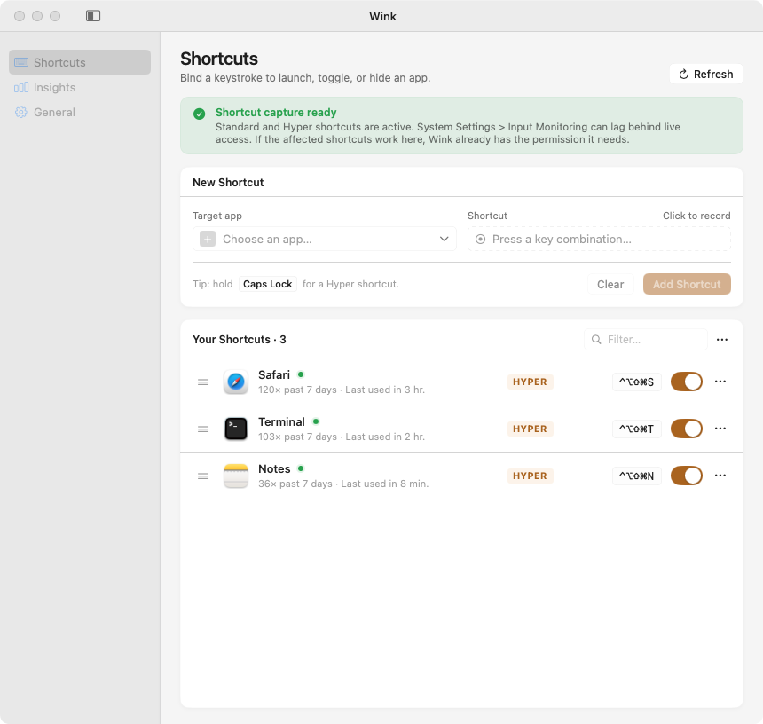

# Wink

<p align="center">
  <picture>
    <source media="(prefers-color-scheme: dark)" srcset="docs/screenshot-dark.png">
    
  </picture>
</p>

Wink is a macOS menu bar app for opening, focusing, and hiding apps with global shortcuts. It keeps the interaction deliberately small: press a shortcut once to bring an app forward, press it again to get it out of the way.

Website: [wink.aixie.de](https://wink.aixie.de) · User guide: [English](https://wink.aixie.de/guide) / [中文](https://wink.aixie.de/guide/zh)

## Why "Wink"?
Wink suggests a quick, subtle signal: something that happens almost instantly and then gets out of the way. That is the feeling Wink aims for when switching apps.

## Highlights
- Bind letters, function keys, arrows, or Space to target apps, with normal modifier shortcuts or a Hyper shortcut path based on Caps Lock.
- Launch missing apps, focus running apps, or hide the frontmost target with Thor-like toggle semantics.
- Or set a shortcut to cycle through its target's windows on repeat presses — minimized ones included, with a HUD showing where you are — or to open a window picker on hold.
- Target "the frontmost app" to cycle whatever you are working in, without a per-app binding.
- Summon a search palette from its own trigger shortcut, type a few letters, and land on any installed app.
- Hold the Hyper key to see a cheat sheet of every bound shortcut.
- Review usage in the Insights tab — trends, a weekly heatmap, and shortcut suggestions for apps you switch to often. All of it stays on your Mac.
- Exception rules auto-pause capture while a VM or remote desktop is frontmost, and Secure Input degradation is surfaced in the menu bar instead of failing silently.
- Import and export `.winkrecipe` shortcut sets.
- Launch at login, in-app Sparkle updates.
- Available in English and Simplified Chinese (zh-Hans); see [`docs/localization.md`](docs/localization.md) for how to add a locale.

## Requirements
- macOS 15 or later.
- Accessibility permission for global shortcut routing.
- Input Monitoring only when Hyper-routed shortcuts are enabled.
- Swift 6 when building from source.

## Build
```bash
swift build
swift test
./scripts/package-app.sh
open build/Wink.app
```

Useful packaging commands:

```bash
./scripts/package-update-zip.sh
./scripts/package-dmg.sh
./scripts/e2e-full-test.sh
```

Always launch the packaged app with `open build/Wink.app` when testing permissions. macOS ties Accessibility and Input Monitoring grants to the app identity, signature, and bundle path; launching the raw binary is not equivalent.

## Automation

Wink exposes its toggle semantics on a `wink://` URL scheme, so Raycast, Karabiner, BetterTouchTool, Stream Deck, or plain shell scripts can drive it — including the SkyLight forced activation that scripts cannot perform themselves:

```bash
open -g "wink://toggle?bundle=com.google.Chrome"   # toggle an installed app
open -g "wink://pause"                             # pause all shortcuts
open -g "wink://resume"                            # resume
```

Use `open -g` (background): a plain `open` activates Wink to deliver the URL, which makes the target count as "not frontmost" and turns every toggle into an activate.

Unknown commands and uninstalled bundles are logged and ignored. Automation presses respect the per-bundle cooldown but never count toward Insights usage.

## Technical Notes
- Standard shortcuts use Carbon hotkeys.
- Hyper-routed shortcuts use an active event tap.
- Reliable activation for an accessory app depends on SkyLight, a private macOS API. See [`docs/architecture.md`](./docs/architecture.md) for the platform trade-offs.
- Runtime-sensitive behavior must be validated on macOS, not inferred from source inspection alone.

## Documentation
- [User guide](https://wink.aixie.de/guide) ([中文](https://wink.aixie.de/guide/zh))
- [`docs/README.md`](./docs/README.md)
- [`docs/architecture.md`](./docs/architecture.md)
- [`docs/github-automation.md`](./docs/github-automation.md)
- [`docs/privacy.md`](./docs/privacy.md)
- [`docs/localization.md`](./docs/localization.md)
- [`docs/signing-and-release.md`](./docs/signing-and-release.md)
