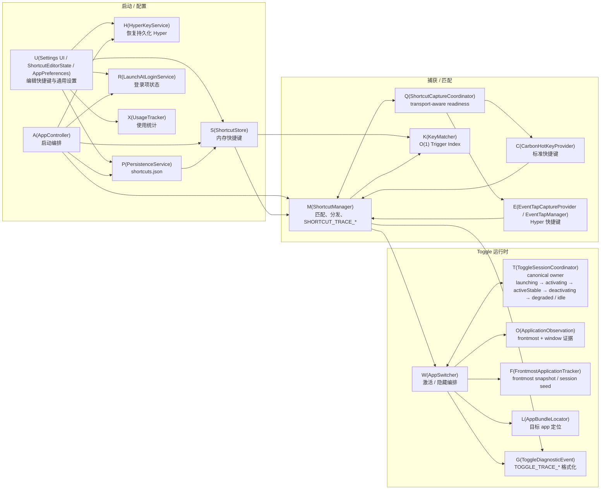

# Architecture

## High-level overview
Quickey is a menu bar macOS utility that stores app-shortcut bindings, captures global key events, matches them to stored shortcuts, and toggles target apps.



## Main modules

### App lifecycle
- `main.swift`
- `AppDelegate`
- `AppController`

Responsibilities:
- start the accessory/menu bar app
- load persisted shortcuts
- start global shortcut handling
- install menu bar UI
- open settings window

### Settings and user interaction
- `SettingsWindowController`
- `SettingsView` (tabbed: Shortcuts / General / Insights)
- `ShortcutEditorState`
- `AppPreferences`
- `ShortcutRecorderView`
- `ShortcutsTabView`
- `GeneralTabView`
- `InsightsTabView`
- `InsightsViewModel`
- `BarChartView`

Responsibilities:
- choose target applications
- record shortcuts
- display saved bindings with inline usage stats
- surface truthful shortcut readiness via `ShortcutCaptureStatus`
- surface launch-at-login state via `LaunchAtLoginStatus`
- show conflicts before saving
- display usage trends and app ranking via Insights tab

### Shortcut domain
- `AppShortcut`
- `RecordedShortcut`
- `ShortcutConflict`
- `ShortcutStore`
- `ShortcutValidator`

Responsibilities:
- represent saved shortcut bindings
- represent recorder output
- detect duplicate/conflicting bindings
- hold in-memory state used by the event path and UI
- persist only the current `[AppShortcut]` schema; unsupported or partially corrupted payloads are load failures, not best-effort partial recovery

### Event capture and matching
- `ShortcutCaptureCoordinator`
- `CarbonHotKeyProvider`
- `EventTapManager`
- `EventTapCaptureProvider`
- `KeyMatcher`
- `KeySymbolMapper`

Responsibilities:
- route standard shortcuts to Carbon `EventHotKey`
- reserve the CGEvent tap path for Hyper-dependent shortcuts only
- host the active Hyper event tap on a dedicated background RunLoop thread
- normalize captured key events
- map between key codes and human-readable shortcut symbols
- match incoming events against stored bindings
- keep provider callback work lightweight and always hop back to the main actor before app toggling
- report capture readiness as capability-aware state instead of a single global boolean:
  - Accessibility granted
  - Input Monitoring granted
  - Carbon hotkeys registered
    - standard Carbon readiness is all-or-nothing per enabled binding: partial `RegisterEventHotKey` success keeps Carbon readiness false until every desired standard binding registers
  - Hyper event tap active
  - standard shortcuts ready
  - Hyper shortcuts ready
  - expose structured standard-registration failure diagnostics (failed keyCode/modifier/status tuples) so logs and UI can explain blocked bindings consistently
- track lifecycle state and escalation thresholds:
  - first timeout -> in-place re-enable
  - 3 timeouts within 30 seconds -> full recreation
  - 2 recreation failures within 120 seconds -> degraded readiness state
- recreate the tap on the same background thread using a reusable readiness mechanism instead of a one-shot startup handshake

### Activation and toggle logic
- `AppSwitcher`
- `ApplicationObservation`
- `ToggleSessionCoordinator`
- `FrontmostApplicationTracker`
- `AppBundleLocator`

Responsibilities:
- activate target apps
- launch installed apps if not already running
- fall back to `NSWorkspace` reopen requests before plain AppKit activation requests when SkyLight activation cannot complete
- build `ActivationObservationSnapshot` values from frontmost-app, active/hidden, visible-window, focused-window, main-window, and app-classification evidence
- re-evaluate app classification per toggle attempt instead of caching it globally
- keep per-target toggle sessions on the main actor and let `ToggleSessionCoordinator` own the full pid-aware lifecycle for `launching`, `activating`, `activeStable`, `degraded`, `deactivating`, and `idle`
- treat `ToggleSessionCoordinator` as the canonical lifecycle owner; `AppSwitcher` only exposes derived pending/stable views instead of keeping a second mutable toggle owner
- keep durable `previousBundle`, `attemptID`, `pid`, and activation path on the coordinator session so relaunches and pid rollover stay traceable
- attach the `NSRunningApplication` returned by `NSWorkspace.openApplication` back onto the existing `launching` session so launch and activate share the same confirmation pipeline
- invalidate or clear sessions from `NSWorkspace.didActivateApplicationNotification` and `NSWorkspace.didTerminateApplicationNotification` instead of polling
- only allow toggle-off from a confirmed stable state; repeat triggers during pending or degraded activation re-confirm the session instead of restoring away
- use `FrontmostApplicationTracker` only to snapshot the current non-target frontmost bundle before a session is accepted, and let session-owned `previousBundle` remain the source of truth after that point
- only allow windowless stable success for non-regular targets; regular apps must show visible/focused/main-window evidence before toggle-on can become `activeStable`
- keep the hot activation path to front-process activation only, then escalate to `makeKeyWindow`, `AXRaise`, and window recovery only when observation shows activation is not yet settled
- toggle off by requesting `NSRunningApplication.hide()`, then confirm deactivation asynchronously from `NSWorkspace.didHideApplicationNotification` plus a short observation window before clearing session state
- when an app is externally frontmost and unowned, still create a coordinator-owned `deactivating` session before dispatching `hide()` so `hide_untracked` remains an explicit, traceable toggle lane instead of an ad-hoc branch
- emit `TOGGLE_TRACE_*` lifecycle diagnostics from accepted-toggle transitions and `SHORTCUT_TRACE_*` diagnostics only from matched or explicitly blocked shortcut boundaries
- reveal selected application in Finder when needed

### Usage tracking
- `UsageTracker`

Responsibilities:
- record shortcut activations with SQLite daily aggregation
- provide usage counts per shortcut for Insights UI
- run off the main actor via Swift actor isolation

### Permissions and packaging
- `AccessibilityPermissionService`
- `LaunchAtLoginService`
- `ShortcutCaptureStatus`
- `scripts/package-app.sh`
- `Sources/Quickey/Resources/Info.plist`

Responsibilities:
- request/check Accessibility + Input Monitoring permission for global shortcuts
- request Input Monitoring only when the current enabled shortcut set actually requires Hyper transport, and defer the request until Accessibility is already available
- report shortcut readiness from both permissions plus live Carbon/event-tap state
- recover monitoring after permission changes without relaunch
- manage launch-at-login state via `SMAppService`, including approval-needed state
- distinguish `SMAppService.Status.notFound` caused by install location from a real bundle-configuration miss before surfacing launch-at-login guidance
- provide LSUIElement app bundle scaffold
- automate `.app` packaging via script

## Runtime event flow

### 1. Startup flow
```text
App launch
  -> AppController.start()
  -> PersistenceService.load()
  -> ShortcutStore.replaceAll()
  -> HyperKeyService.reapplyIfNeeded()
  -> ShortcutManager.setHyperKeyEnabled(hyperKeyService.isEnabled)
  -> ShortcutManager.start()
  -> ShortcutManager rebuilds the trigger index and updates routed shortcuts in ShortcutCaptureCoordinator
  -> AccessibilityPermissionService requests Accessibility, and requests Input Monitoring only when current routes require Hyper and Accessibility is already granted
  -> ShortcutManager starts permission polling and calls attemptStartIfPermitted()
  -> ShortcutCaptureCoordinator syncs providers for the current standard/Hyper split
  -> CarbonHotKeyProvider registers enabled standard shortcuts
  -> EventTapCaptureProvider/EventTapManager starts only when Input Monitoring is granted and Hyper-routed shortcuts exist
  -> MenuBarController.install()
```

### 2. Add shortcut flow
```text
User opens settings
  -> SettingsWindowController.show() wires ShortcutEditorState + AppPreferences into SettingsView
  -> user chooses app
  -> ShortcutRecorderView stores RecordedShortcut in ShortcutEditorState
  -> ShortcutEditorState.addShortcut() builds AppShortcut
  -> ShortcutValidator checks conflicts against current shortcuts
  -> ShortcutManager.save(updated shortcuts)
  -> ShortcutStore.replaceAll()
  -> PersistenceService.save()
  -> ShortcutCaptureCoordinator refreshes routed shortcuts / provider state
  -> onShortcutConfigurationChange triggers AppPreferences.refreshPermissions()
```

### 3. Trigger flow
```text
Global shortcut event
  -> CarbonHotKeyProvider or EventTapCaptureProvider emits KeyPress into ShortcutCaptureCoordinator
  -> ShortcutManager.handleKeyPress()
  -> KeyMatcher normalizes KeyPress into ShortcutTrigger and triggerIndex finds the matching AppShortcut
  -> ShortcutManager emits `SHORTCUT_TRACE_DECISION event=matched`
  -> AppSwitcher.toggleApplication()
  -> if no owned session exists yet, FrontmostApplicationTracker snapshots the current non-target frontmost bundle
  -> ToggleSessionCoordinator creates/updates the pid-aware attempt session and owns durable `previousBundle`
  -> ApplicationObservation captures frontmost/window evidence
  -> activate / confirm / recover stage-by-stage
  -> `TOGGLE_TRACE_*` lines record branch reason, reset reason, and confirmation outcome for that attempt
  -> direct hide request only from activeStable, then async hide confirmation
```

### 4. Event tap recovery flow
```text
CGEvent callback receives tapDisabledByTimeout / tapDisabledByUserInput
  -> EventTapManager captures callback-safe snapshot
  -> in-place re-enable happens immediately
  -> lifecycle tracker updates counters
  -> repeated timeout threshold reached
  -> same-thread tap recreation on the dedicated background RunLoop
  -> recreation success returns readiness to running
  -> repeated recreation failure escalates readiness to degraded
```

## Current design choices
- **SPM-first**: simple repo layout and source organization
- **AppKit-first with selective SwiftUI**: deliberate architectural decision documented in `docs/archive/app-structure-direction.md`; hard AppKit requirements (`.accessory` policy, raw key capture, CGEvent tap, NSWorkspace) prevent a pure SwiftUI scene-based approach
- **Capability-aware shortcut readiness**: `ShortcutCaptureStatus` separates Accessibility, Input Monitoring, Carbon registration, Hyper event-tap activity, standard-shortcut readiness, and Hyper readiness
- **On-demand Input Monitoring**: startup and later shortcut-routing changes request Input Monitoring only when the current enabled shortcut set actually needs Hyper transport; standard-only configurations stay on the Carbon/Accessibility path without an eager Input Monitoring prompt, and Hyper-required startup defers the Input Monitoring request until Accessibility has actually been granted
- **Strict persistence schema**: Quickey currently supports only the exact `[AppShortcut]` payload it writes today; if `shortcuts.json` is malformed or missing required fields, loading fails loudly, logs `path` plus `reason`, and preserves a `shortcuts.load-failure-*.json` copy instead of silently treating the state as empty
- **O(1) trigger index**: `ShortcutSignature` dictionary replaces linear scans in the hot path
- **Observation-first toggle truth**: `ApplicationObservation` snapshots gate stable-state promotion from frontmost/window evidence instead of trusting `isActive` alone
- **Single-source toggle ownership**: `ToggleSessionCoordinator` is the only mutable lifecycle owner; `AppSwitcher` derives pending/stable views from coordinator state instead of dual-writing local activation state
- **Session-owned previous-app memory**: `ToggleSessionCoordinator` holds the durable `previousBundle` once a toggle session is accepted; `FrontmostApplicationTracker` only seeds that value from the currently frontmost non-target bundle before session ownership exists
- **Pid-aware attempt sessions**: launch / relaunch / termination recovery use attempt-scoped sessions that track `attemptID`, `pid`, `activationPath`, and current phase so process-lifetime boundaries cannot silently desynchronize ownership
- **No-window success policy**: regular apps require usable window evidence before `activeStable`; only `activationPolicy != .regular` targets may succeed while windowless
- **Attempt-scoped diagnostics**: `TOGGLE_TRACE_*` and `SHORTCUT_TRACE_*` explain branch choice and failure boundaries without adding detailed logs to unrelated key events
- **Notification-driven invalidation**: `NSWorkspace` activation and termination notifications clear or expire stable/deactivating sessions without polling
- **Hardened EventTap lifecycle**: explicit ownership, callback-safe timeout snapshots, threshold-based escalation, and same-thread run-loop recreation
- **Split capture transports**: standard shortcuts use Carbon hotkeys; Hyper-only shortcuts use the active event tap. Passive `.listenOnly` mode is not used in the interception path because it cannot consume shortcut events
- **SkyLight primary activation path**: private API is used for reliable foreground switching from LSUIElement context
- **Modern AppKit fallback**: when SkyLight activation fails, Quickey re-requests activation via `NSWorkspace.OpenConfiguration` (`activates = true`) and only falls back to a plain AppKit activation request if no bundle URL is available
- **Minimal-by-default activation**: front-process activation is the only hot-path activation step; `makeKeyWindow`, `AXRaise`, and reopen/new-window recovery are bounded escalation steps driven by observation
- **Stable-state toggle semantics**: activate immediately, confirm asynchronously, allow toggle-off only from `activeStable`, and avoid restore-away rollback on confirmation failure
- **Official hide request path**: toggle-off uses `NSRunningApplication.hide()` plus asynchronous confirmation instead of event-synthesized hide commands
- **Service-level test seams**: system-facing services use small injected clients or existing collaborators so runtime decision logic can be covered without live TCC or app-launch side effects
- **UsageTracker**: SQLite-backed daily usage aggregation off the main actor
- **Launch-at-login status modeling**: `LaunchAtLoginStatus` preserves enabled / approval-needed / disabled / not-found states

## Known architectural gaps
- No dedicated per-shortcut toggle history stack beyond the tracker seed plus the active session's single `previousBundle`
- No test seam around event-tap capture itself (core logic is testable; tap infrastructure requires real macOS)
- Signed/notarized release build not yet produced (workflow documented in `docs/signing-and-release.md`)
- Targeted manual macOS validation is still required for the 2026-04-08 capture/activation/hide redesign, especially Safari-only toggle-off, standard-shortcut vs Hyper parity, permission-state transitions, system apps, hidden/minimized window paths, and timeout-stress behavior
