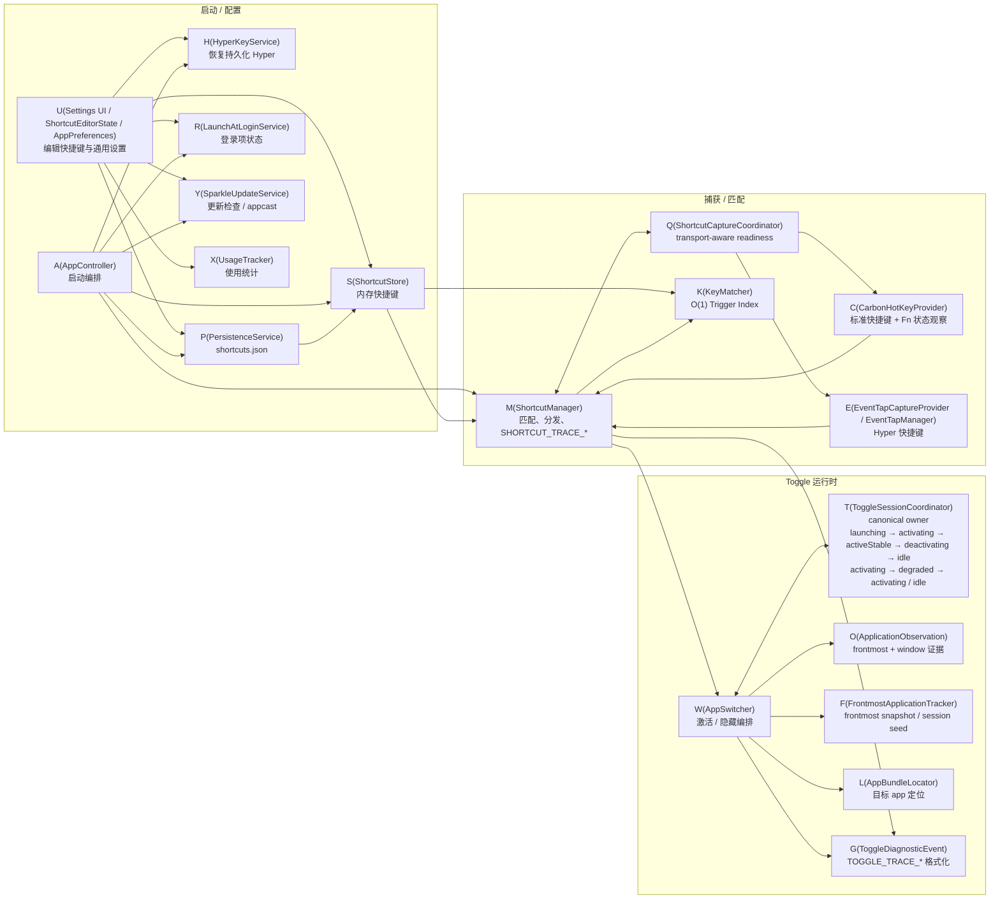

# Architecture

## High-level overview
Wink is a menu bar macOS utility that stores app-shortcut bindings, captures global key events, matches them to stored shortcuts, and toggles target apps.


```mermaid
flowchart LR
  subgraph B["启动 / 配置"]
    A["A(AppController)\n启动编排"]
    H["H(HyperKeyService)\n恢复持久化 Hyper"]
    P["P(PersistenceService)\nshortcuts.json"]
    S["S(ShortcutStore)\n内存快捷键"]
    U["U(Settings UI / ShortcutEditorState / AppPreferences)\n编辑快捷键与通用设置"]
    R["R(LaunchAtLoginService)\n登录项状态"]
    Y["Y(SparkleUpdateService)\n更新检查 / appcast"]
    X["X(UsageTracker)\n使用统计"]
  end

  subgraph C["捕获 / 匹配"]
    M["M(ShortcutManager)\n匹配、分发、SHORTCUT_TRACE_*"]
    Q["Q(ShortcutCaptureCoordinator)\ntransport-aware readiness"]
    C1["C(CarbonHotKeyProvider)\n标准快捷键 + Fn 状态观察"]
    E["E(EventTapCaptureProvider / EventTapManager)\nHyper 快捷键"]
    K["K(KeyMatcher)\nO(1) Trigger Index"]
  end

  subgraph T["Toggle 运行时"]
    W["W(AppSwitcher)\n激活 / 隐藏编排"]
    T1["T(ToggleSessionCoordinator)\ncanonical owner\nlaunching → activating → activeStable → deactivating → idle\nactivating → degraded → activating / idle"]
    O["O(ApplicationObservation)\nfrontmost + window 证据"]
    F["F(FrontmostApplicationTracker)\nfrontmost snapshot / session seed"]
    L["L(AppBundleLocator)\n目标 app 定位"]
    G["G(ToggleDiagnosticEvent)\nTOGGLE_TRACE_* 格式化"]
  end

  U --> P
  U --> S
  U --> H
  U --> R
  U --> Y
  U --> X

  A --> P
  A --> S
  A --> H
  A --> M
  A --> R
  A --> Y

  P --> S
  S --> M
  S --> K
  M --> K

  M <--> Q
  Q --> C1
  Q --> E
  C1 --> M
  E --> M

  M --> W
  W <--> T1
  W --> O
  W --> F
  W --> L

  M --> G
  W --> G
```

## Main modules

### App lifecycle
- `WinkApp`
- `AppDelegate`
- `AppController`
- `SettingsLauncher`
- `SparkleUpdateService`

Responsibilities:
- declare the SwiftUI `MenuBarExtra(.window)` and `Settings` scenes and install the shared `openSettings()` bridge
- start the accessory/menu bar app via `@NSApplicationDelegateAdaptor`
- start the Sparkle updater when feed configuration is present
- load persisted shortcuts
- start global shortcut handling
- keep menu bar insertion bound to the persisted `menuBarIconVisible` preference
- present Settings and reactivate Wink when first-launch, menu-bar, or reopen entry points request it

### Menu bar shell
- `WinkMenuBarScene`
- `MenuBarPopoverView`
- `ShortcutStatusProvider`

Responsibilities:
- host `MenuBarExtra(.window)` with a custom SwiftUI label backed by the generated Wink Twin menu bar template image instead of the older SF Symbol shell
- load the menu bar image from packaged PNG resources, mark the backing `NSImage` as template, and render it through `Image(nsImage:)` so light/dark and highlighted menu bar states use AppKit's template tinting path
- show the v2 popover shell (wordmark, version, Ready/Paused pill, real search filter, Today hourly histogram, shortcut rows, action rows)
- reuse `ShortcutStore` and `ShortcutStatusProvider` so the popover reflects saved ordering plus running/unavailable state
- route `Manage…` to `Settings > Shortcuts`, `Settings…` to the shared Settings bridge, `Check for Updates…` to Sparkle, and `Quit Wink` to app termination
- keep `Pause all shortcuts` wired to the real shortcut-capture runtime instead of a UI-only placeholder
- avoid any fallback `NSStatusItem` / `NSMenu` compatibility shell now that the SwiftUI scene owns the menu bar UI

### Settings and user interaction
- `SettingsLauncher`
- `SettingsNavigation`
- `SettingsView` (`NavigationSplitView`: Shortcuts / Insights / General)
- `ShortcutEditorState`
- `AppPreferences`
- `UpdateServicing`
- `ShortcutRecorderView`
- `ShortcutsTabView`
- `GeneralTabView`
- `InsightsTabView`
- `InsightsViewModel`

Responsibilities:
- bridge menu bar, first-launch, and reopen callers to SwiftUI `openSettings()` without a custom `NSWindow` host
- persist the selected Settings tab and reopen that tab on the next Settings launch
- choose target applications
- record shortcuts
- display saved bindings with inline usage stats
- export/import shareable shortcut recipes from Settings
- preview import conflicts and unresolved targets before mutating persisted shortcuts
- surface truthful shortcut readiness via `ShortcutCaptureStatus`
- surface launch-at-login state via `LaunchAtLoginStatus`
- surface Sparkle update status and the manual `Check for Updates…` entry without leaking Sparkle types into SwiftUI
- persist General-tab preferences such as `frontmostTargetBehavior`
- show conflicts before saving
- display usage trends and app ranking via Insights tab

### Shortcut domain
- `AppShortcut`
- `RecordedShortcut`
- `ShortcutConflict`
- `ShortcutStore`
- `ShortcutValidator`
- `ShortcutProfile` / `ShortcutProfileManifest` / `ShortcutProfileActivePointer` / `ShortcutProfileMirrorDescriptor`
- `ShortcutProfileNameRules`

Responsibilities:
- represent saved shortcut bindings
- represent recorder output
- represent versioned, human-readable shortcut recipe payloads for export/import
- detect duplicate/conflicting bindings
- hold in-memory state used by the event path and UI
- persist only the current `[AppShortcut]` schema, whose `id` values must be unique across the entire array (including disabled entries); unsupported, duplicate-ID, or partially corrupted payloads are load failures, not best-effort partial recovery
- represent named shortcut sets (profiles) and the rules that keep their names addressable: 1–64 characters, unique case-insensitively over NFC-normalized names, at most 32 profiles. Profile identity is always the UUID, never the name, so a rename cannot orphan the active pointer
- keep shortcut `id` values unique across **all** profiles, which is what lets `usage.db` stay keyed by shortcut UUID alone with no profile column

### Shortcut profiles
- `ShortcutProfileStore`
- `ShortcutProfileState`
- `ProfileBar` / `ProfileManagerSheet`

Responsibilities:
- own `Application Support/Wink/Profiles/`: `manifest.json` (the profile list), `active.json` (the active pointer, and the single commit point of a switch), `mirror.json` (a descriptor for the compat file), and one `<profileID>.json` data file per profile whose payload is byte-compatible with the historical `shortcuts.json`
- keep `shortcuts.json` at its original path as a **derived mirror** of the active profile — written last on every save and switch, never read as truth except during first-run migration and the outside-edit check. It is retained because the packaged-app E2E harness, the validation docs, and a downgraded build all still resolve it
- migrate a pre-profiles install into a Default profile by **copying bytes**, never by decoding and re-encoding: `AppShortcut` drops JSON members it does not model, so a round trip would silently discard data a newer build wrote. The same rule governs mirroring, import, and duplication; the first ordinary save of a profile does re-encode, and that boundary is stated rather than implied
- interpret every combination of the four files through three sequential stages — profile list, active pointer, profile data — so no combination is undefined. Every failing state arms **zero** shortcuts and asks; an unreadable configuration never falls through to a different profile's bindings
- never overwrite the compat mirror until a byte-identical copy has been preserved beside it, and never import an outside edit without an explicit user choice
- issue `UsageTracker.deleteUsage` only for shortcut IDs no other profile holds, failing closed when a sibling profile could not be read
- surface profile selection, creation, renaming, duplication, deletion, and every recovery state in Settings and the menu bar, using one `switchToProfile` path from both entry points

### Event capture and matching
- `ShortcutCaptureCoordinator`
- `CarbonHotKeyProvider`
- `EventTapManager`
- `EventTapCaptureProvider`
- `KeyMatcher`
- `KeySymbolMapper`
- `WinkRecipeCodec`
- `WinkRecipeImportPlanner`

Responsibilities:
- route standard shortcuts to Carbon `EventHotKey`
- reserve CGEvent interception and delivery for Hyper-dependent shortcuts; standard Fn+F-row bindings use a separate observer for physical Fn transitions plus F-row key-downs only to disambiguate the Carbon alias, and return every event unchanged
- host the active Hyper interception tap and the narrow Fn/F-row observer on dedicated background RunLoop threads
- normalize captured key events
- map between key codes and human-readable shortcut symbols
- match incoming events against stored bindings
- encode/decode shareable recipe JSON with explicit schema-version checks
- classify imported recipe entries into ready/conflict/unresolved plans before persistence
- keep provider callback work lightweight and always hop back to the main actor before app toggling
- apply a whole shortcut set through one seam, `ShortcutManager.applyLoadedShortcuts(_:source:)`: an ordinary save and a profile switch run the same synchronous main-actor block, so no observable state mixes one set's store with another's trigger index. That property comes from the actor isolation, not from timing, which is why a profile switch introduces no second capture-synchronization stack
- report capture readiness as capability-aware state instead of a single global boolean:
  - Accessibility granted
  - Input Monitoring granted
  - Carbon hotkeys registered
    - standard Carbon readiness is all-or-nothing per enabled binding: partial `RegisterEventHotKey` success keeps Carbon readiness false until every desired standard binding registers
    - Fn+F-row registrations additionally require a live Fn/F-row observer. It snapshots physical Fn state at each F-row key-down and consumes only a same-key Carbon callback inside a bounded timestamp window, so callback delay preserves a valid chord while a later Fn press cannot authorize an earlier bare F-row event. If Input Monitoring or the observer is unavailable, only affected bindings fail while unrelated standard Carbon bindings remain registered
  - Hyper event tap active
  - standard shortcuts ready
  - Hyper shortcuts ready
  - expose structured standard-registration failure diagnostics (failed keyCode/modifier/status tuples) so logs and UI can explain blocked bindings consistently
- track lifecycle state and escalation thresholds:
  - first timeout -> in-place re-enable
  - 3 timeouts within 30 seconds -> full recreation
  - 2 recreation failures within 120 seconds -> degraded readiness state
- own the Hyper tap, source, callback box, and RunLoop thread as one generation-scoped session; readiness never substitutes for ownership during stop/restart teardown
- recreate the tap on the same background thread using a reusable readiness mechanism instead of a one-shot startup handshake; a failed first replacement executes its retry, while the retry limit tears down the complete session before reporting degraded readiness
- reject queued key/recovery callbacks whose generation no longer matches the current session, and join the old RunLoop thread before releasing its callback box or publishing a replacement owner

### Exception rules
- `FrontmostExceptionMonitor`

Responsibilities:
- auto-pause shortcut capture while an enabled exception bundle is frontmost, via `NSWorkspace.didActivateApplicationNotification` plus call-time snapshots (no TCC, no taps)
- re-evaluate the live frontmost app when rules/enabled change so edits take effect without an app switch
- report the triggering app's display name for the menu bar pill; `ShortcutManager` composes the auto bit with the manual pause by OR, and only the OR's transitions touch the capture runtime

### Activation and toggle logic
- `AppSwitcher`
- `ApplicationObservation`
- `ToggleSessionCoordinator`
- `WindowCycleCoordinator`
- `FrontmostApplicationTracker`
- `AppBundleLocator`

Responsibilities:
- activate target apps
- launch installed apps if not already running
- fall back to `NSWorkspace` reopen requests before plain AppKit activation requests when SkyLight activation cannot complete
- build `ActivationObservationSnapshot` values from frontmost-app, active/hidden, visible-window, focused-window, main-window, and app-classification evidence
- re-evaluate app classification per toggle attempt instead of caching it globally
- keep per-target toggle sessions on the main actor and let `ToggleSessionCoordinator` own the full pid-aware lifecycle for `launching`, `activating`, `activeStable`, `degraded`, `deactivating`, and `idle`
- treat `ToggleSessionCoordinator` as the canonical lifecycle owner; `AppSwitcher` only exposes derived pending/stable views instead of keeping a second mutable toggle owner
- keep `attemptID`, `pid`, phase, timing, and activation path on the coordinator session so relaunches and pid rollover stay traceable
- attach the `NSRunningApplication` returned by `NSWorkspace.openApplication` back onto the existing `launching` session so launch and activate share the same confirmation pipeline
- invalidate or clear sessions from `NSWorkspace.didActivateApplicationNotification` and `NSWorkspace.didTerminateApplicationNotification` instead of polling; termination transitions an affected degraded session to `idle` while preserving its attempt diagnostics
- only allow toggle-off from a confirmed stable state; recovery exhaustion transitions `activating → degraded` under the same `attemptID` and generation, and a repeat trigger atomically checks the absolute ceiling, degraded-idle expiry, and retry cap before it can re-confirm that same session
- an accepted degraded repeat transitions `degraded → activating`, then either reaches `activeStable` from fresh stable evidence or returns to `degraded` after the bounded recovery ladder; retry-cap and absolute-ceiling results transition to `idle` and end the trigger before activation, hide, or recovery side effects
- reject activation confirmation callbacks whose generation no longer matches the owned session, so a stale attempt cannot mutate a newer `activating` or `degraded` generation
- only allow windowless stable success for non-regular targets; regular apps must show visible/focused/main-window evidence before toggle-on can become `activeStable`
- pair every successful SkyLight hot activation with an immediate key/front order of the first VERIFIED content window (`makeKeyWindow` + `kAXRaiseAction` through the window-cycle seams; auxiliary elements like Split View dividers are never ordered, and an indeterminate `isContentWindow` read skips the element) — front-process alone left window raising to the target's own AppKit response, which silently no-ops while another process' key panel is closing (#403); reopen/new-window recovery still escalates only when observation shows activation is not yet settled
- toggle off by requesting `NSRunningApplication.hide()`, then confirm deactivation asynchronously from `NSWorkspace.didHideApplicationNotification` plus a short observation window before clearing session state; a zero-window result is affirmative only when that AX windows read succeeded, while `isHidden` remains an independent confirmation signal
- when an app is externally frontmost and unowned, still create a coordinator-owned `deactivating` session before dispatching `hide()` so `hide_untracked` remains an explicit, traceable toggle lane instead of an ad-hoc branch
- frontmost-app pseudo-targets rewrite themselves onto the current `NSWorkspace` frontmost application at the entry of `toggleApplication` (call-time snapshot via `FrontmostApplicationTracker.currentFrontmostApplication`), then run the normal lanes with an effective Cycle behavior; unresolvable presses (no frontmost, or Wink itself) are rejected, and un-cyclable presses are no-ops instead of hides
- the frontmost lane resolves each press through `effectiveFrontmostBehavior(for:)` — the shortcut's optional `frontmostBehaviorOverride` when set, the global preference otherwise; the override persists in shortcuts.json with lenient decoding (unknown values → nil, nil omits the key) so schema evolution can never quarantine the file, and `.winkrecipe` carries it as an optional raw string under schema v1
- the Cycle frontmost behavior reuses the pre-action window observation (no extra hot-path AX enumeration), resolves each window to a `CGWindowID` via `_AXUIElementGetWindow`, rotates over the sorted-wid order, and focuses the chosen window with the standard trio (`_SLPSSetFrontProcessWithOptions` with the target wid → `makeKeyWindow` down/up event pair → `kAXRaiseAction`), unminimizing the single target window first when needed
- `WindowCycleCoordinator` keeps the cycle cursor (`bundle`, `pid`, last target wid, visited-wid set, step diagnostics) on the main actor and prefers a live session cursor over the lagging AX focused-window report, unless the reported focused window was never visited this gesture (manual intra-app switch) — then it re-seeds from it; invalidation is eager on frontmost change, target termination, and behavior change, and lazy (next advance) for pid rollover, the 3s idle expiry, and a cursor missing from the window list; cycle attempts never create `ToggleSessionCoordinator` sessions because the target stays frontmost throughout, and a successful cycle promotes a still-pending activation session to stable so its confirmation ladder cannot re-raise the first window
- cycle feedback: from the second consecutive press of a gesture, a display-only non-activating HUD panel (app icon + "step/count · AX window title", never key/main, mouse-transparent, all-Spaces) anchors to the display hosting the cycled window (resolved from its CG bounds; geometry is not TCC-gated) and self-dismisses after 1.2s; titles come from AX `kAXTitle` only — never CGWindowList, which would require Screen Recording
- the per-bundle cooldown gate is behavior-aware and session-gated: the shorter 150ms cycle cooldown applies only to established cycling (behavior is Cycle, a live cycle session exists for the bundle, and a cheap workspace-snapshot pre-check says the target is frontmost — no AX); every press that could fall through to the hide lanes keeps the standard 400ms value, and a windows-read failure during a live gesture swallows the press instead of declining into the hide lanes
- emit `TOGGLE_TRACE_*` lifecycle diagnostics from accepted-toggle transitions and `SHORTCUT_TRACE_*` diagnostics only from matched or explicitly blocked shortcut boundaries
- reveal selected application in Finder when needed

### Usage tracking
- `UsageTracker`

Responsibilities:
- record shortcut activations with SQLite daily and hourly aggregation using locale-pinned (`en_US_POSIX`) ASCII Gregorian `yyyy-MM-dd` buckets, shared through `UsageWindowMath.dateKeyFormatter` by every writer and parser of persisted date keys (issue #323)
- provide current-window counts, previous-period totals, streaks, and hourly heatmap buckets for Insights and the menu bar Today view
- migrate supported v2 databases in place to schema v3 during bootstrap: localized-digit date keys are normalized to ASCII inside one transaction, primary-key collisions merge by summing counts, unrecognizable keys are left untouched, and any failure (including a failed key scan) rolls back completely and stays at v2 so the next launch retries
- still reset only pre-v2/unknown legacy database shapes explicitly before startup opens the live database, instead of keeping a half-migrated schema around; the fresh-database version stamp happens only at `user_version` 0 so a failed migration is never masked
- run off the main actor via Swift actor isolation

### Permissions and packaging
- `AccessibilityPermissionService`
- `LaunchAtLoginService`
- `UpdateServicing`
- `SparkleUpdateService`
- `ShortcutCaptureStatus`
- `scripts/build-app-icon.sh`
- `scripts/package-app.sh`
- `scripts/package-update-zip.sh`
- `scripts/generate-appcast.sh`
- `Sources/Wink/Resources/Info.plist`

Responsibilities:
- request/check Accessibility + Input Monitoring permission for global shortcuts
- request Input Monitoring only when the current enabled shortcut set requires Hyper transport or a standard Fn+F-row observer, and defer the request until Accessibility is already available
- report shortcut readiness from both permissions plus live Carbon/event-tap state
- recover monitoring after permission changes without relaunch
- keep persisted unresolved shortcuts in `shortcuts.json`, but only register enabled shortcuts whose target app currently resolves via `NSWorkspace.urlForApplication(withBundleIdentifier:)`
- re-check target-app availability during the existing permission poll so installs/uninstalls can resync registered shortcuts without another save or relaunch
- manage launch-at-login state via `SMAppService`, including approval-needed state
- start Sparkle only when `SUFeedURL` and `SUPublicEDKey` are present in the packaged app's `Info.plist`
- keep signed-feed defaults (`SURequireSignedFeed` + `SUVerifyUpdateBeforeExtraction`) in `Info.plist`
- distinguish `SMAppService.Status.notFound` caused by install location from a real bundle-configuration miss before surfacing launch-at-login guidance
- provide LSUIElement app bundle scaffold
- regenerate `AppIcon.icns` and the menu bar template PNGs from the SVG sources for Dock, menu bar, and packaged-app consistency
- embed and re-sign `Sparkle.framework` for packaged builds, removing unused XPC services because Wink is not sandboxed
- automate `.app`, Sparkle update zip, and signed appcast packaging via scripts

### Localization
- `Sources/Wink/Resources/Localizable.xcstrings` (source of truth, hand-authored)
- `Sources/Wink/Resources/Localized/{en,zh-Hans}.lproj` (generated, checked in)
- `scripts/gen-localizations.sh`
- `WinkResourceBundle`

Responsibilities:
- ship a String Catalog with English as the default localization and zh-Hans as the first translated locale, English-as-key throughout
- compile `.xcstrings` → per-locale `.lproj` via `xcrun xcstringstool compile` ahead of time, because plain `swift build` (unlike an Xcode build) never compiles `.xcstrings` itself
- route every localized lookup through `WinkResourceBundle.bundle`

See `docs/localization.md` for the full architecture, the SPM lowercased-lproj quirk, and how to add a string or a locale.

## Runtime event flow

### 1. Startup flow
```text
App launch
  -> WinkApp declares MenuBarExtra(.window) with a custom template-image label + Settings scenes + SettingsCommands
  -> MenuBarExtra insertion is bound to `menuBarIconVisible`
  -> @NSApplicationDelegateAdaptor creates AppDelegate
  -> AppDelegate.applicationDidFinishLaunching()
  -> NSApp.setActivationPolicy(.accessory)
  -> AppController.start()
  -> SparkleUpdateService initializes if SUFeedURL + SUPublicEDKey are configured
  -> ShortcutProfileStore.load() (migrates a pre-profiles install, or interprets the
     profile list / active pointer / profile data through the three recovery stages)
  -> ShortcutProfileState publishes the profile list, the active profile, and any
     recovery state; a failing state returns an EMPTY shortcut set
  -> ShortcutStore.replaceAll()
  -> HyperKeyService.reapplyIfNeeded()
  -> ShortcutManager.setHyperKeyEnabled(hyperKeyService.isEnabled)
  -> ShortcutManager.start()
  -> ShortcutManager rebuilds the trigger index and updates routed shortcuts in ShortcutCaptureCoordinator
  -> AccessibilityPermissionService requests Accessibility, and requests Input Monitoring only when current routes require Hyper or a standard Fn+F-row observer and Accessibility is already granted
  -> ShortcutManager starts permission polling and calls attemptStartIfPermitted()
  -> ShortcutCaptureCoordinator syncs providers for the current standard/Hyper split
  -> CarbonHotKeyProvider starts the Fn/F-row observer when needed, then registers enabled standard shortcuts; unavailable observation fails only affected Fn+F-row bindings closed
  -> EventTapCaptureProvider/EventTapManager starts only when Input Monitoring is granted and Hyper-routed shortcuts exist
  -> if this is a fresh install with no saved shortcuts, AppController.openSettings() routes through SettingsLauncher + openSettings()
```

### 2. Add shortcut flow
```text
User opens settings
  -> MenuBarPopover Manage… / Settings… or first-launch / reopen path calls AppController.openSettings(tab: ...)
  -> SettingsLauncher.open(tab: ...) optionally records the desired tab
  -> SettingsCommands invokes SwiftUI EnvironmentValues.openSettings
  -> Settings scene presents SettingsView with shared ShortcutEditorState + AppPreferences + InsightsViewModel
  -> user chooses app
  -> ShortcutRecorderView stores RecordedShortcut in ShortcutEditorState
  -> ShortcutEditorState.addShortcut() builds AppShortcut
  -> ShortcutValidator checks conflicts against current shortcuts
  -> ShortcutManager.save(updated shortcuts) — throws on write failure
  -> PersistenceService.save() (disk first; on failure the in-memory store is untouched and ShortcutEditorState reverts + surfaces saveErrorMessage)
  -> ShortcutStore.replaceAll()
  -> ShortcutCaptureCoordinator refreshes routed shortcuts / provider state
  -> onShortcutConfigurationChange triggers AppPreferences.refreshPermissions()
```

### 2b. Import / export recipe flow
```text
User clicks Export...
  -> ShortcutEditorState.exportRecipeData()
  -> WinkRecipeCodec encodes the current [AppShortcut] state into pretty-printed JSON
  -> NSSavePanel writes a `.winkrecipe` file

User clicks Import...
  -> AppListProvider refreshes the installed-app catalog
  -> NSOpenPanel reads `.winkrecipe` / legacy `.quickeyrecipe` / `.json`
  -> WinkRecipeCodec decodes the payload and validates schemaVersion
  -> ShortcutEditorState builds an import catalog from the latest app scan plus AppBundleLocator fallback lookups
  -> WinkRecipeImportPlanner classifies entries into ready / conflict / unresolved preview buckets
  -> user chooses Skip Conflicts or Replace Existing
  -> ShortcutManager.save(updated shortcuts)
  -> persisted shortcuts keep unresolved targets, but ShortcutManager only registers entries whose apps are currently available
```

### 2c. Manual update check flow
```text
User opens General tab
  -> GeneralTabView reads AppPreferences.updatePresentation
  -> user clicks "Check for Updates…"
  -> AppPreferences.checkForUpdates()
  -> SparkleUpdateService.checkForUpdates()
  -> Sparkle presents the standard update UI if the configured feed has a newer item
```

### 2d. Profile switch flow
```text
User picks a profile (Settings picker or menu bar row)
  -> ShortcutProfileStore.loadProfileForActivation(id)      <- WRITES NOTHING
       -> decode + unique IDs; a refused switch applies nothing and discards nothing
       -> returns the rows AND the exact bytes they came from
  -> ShortcutProfileStore.commitActivation(id, payload)     <- LAST ABORT POINT
       -> re-verifies Profiles/<id>.json still holds those bytes, and refuses if not
       -> commits Profiles/active.json  <- the single commit point, BEFORE memory changes
       -> writes shortcuts.json + mirror.json from the CARRIED bytes, never a re-read
  -- past this line nothing can abort, so destroying the user's work is now safe --
  -> ShortcutProfileState cancels recorder/composer/import drafts and dismisses panels,
     reporting anything discarded (a manual switch may discard; an automatic one defers)
  -> ShortcutManager.applyLoadedShortcuts(_, source: .profileSwitch)
       -> ShortcutStore.replaceAll -> rebuildIndex (once) -> capture reconcile (once)
       -> hold-gesture arbiter reset, window-cycle session invalidated
       -> readiness pushed to observers

Draft cancellation sits AFTER the commit on purpose. It destroys work the user
cannot get back, so it must not run for an operation that can still be refused —
and validation alone cannot be moved late enough to cover the window, because
the re-verification exists precisely to close the gap that preparation opens.
Between the commit and the apply the runtime is still on the outgoing set, which
is the same persist-then-mutate ordering an ordinary save already uses: the
pointer leads memory, never lags it. Deleting the active profile follows the
same rule — preparation waits until `deleteProfile` has returned.
```

### 3. Trigger flow
```text
Global shortcut event
  -> CarbonHotKeyProvider or EventTapCaptureProvider emits KeyPress into ShortcutCaptureCoordinator
  -> ShortcutManager.handleKeyPress()
  -> KeyMatcher normalizes KeyPress into ShortcutTrigger and triggerIndex finds the matching AppShortcut
  -> ShortcutManager emits `SHORTCUT_TRACE_DECISION event=matched`
  -> match.isSearchPaletteTarget? (the #356 search-palette trigger's sentinel bundle names no app)
       yes -> ShortcutManager.onSearchPaletteTriggered() -> AppController presents SearchPaletteHUDController
              -> palette open gates matched dispatch via ShortcutManager.setInteractivePanelSessionActive(true),
                 the same shared gate #352's window picker uses (mutual exclusion falls out of that one flag)
              -> Enter commits: AppController's `activate` closure calls
                 AppSwitcher.toggleApplication(for: adHocShortcut, bypassCooldown: true) with
                 frontmostBehaviorOverride: .focus forced — activate/re-focus only, never a real
                 toggle-off, and never routed through ShortcutManager.trigger (no usage recorded
                 against an unpersisted ad hoc shortcut)
              -> Escape or losing key status dismisses with zero side effects
       no  -> AppSwitcher.toggleApplication() (the standard path below)
  -> ToggleSessionCoordinator creates/updates the pid-aware attempt session
  -> ApplicationObservation captures frontmost/window evidence
  -> activate / confirm / recover stage-by-stage
  -> recovery exhaustion keeps the same attempt/generation and enters degraded
  -> a degraded repeat returns to activating, reaches activeStable from evidence,
     or terminates at retry cap / absolute ceiling with zero further side effects
  -> `TOGGLE_TRACE_*` lines record branch reason, reset reason, and confirmation outcome for that attempt
  -> direct hide request only from activeStable, then async hide confirmation
```

### 4. Event tap recovery flow
```text
CGEvent callback receives tapDisabledByTimeout / tapDisabledByUserInput
  -> EventTapManager captures callback-safe snapshot
  -> in-place re-enable happens immediately
  -> lifecycle tracker updates counters
  -> repeated timeout threshold reached
  -> same-thread tap recreation on the dedicated background RunLoop
  -> recreation success returns readiness to running
  -> repeated recreation failure escalates readiness to degraded
```

## Current design choices
- **SPM-first**: simple repo layout and source organization
- **SwiftUI scene shells over the legacy AppKit menu host**: Wink now uses `@main` + `MenuBarExtra(.window)` + `Settings` + `openSettings()` for the app shell, while shortcut capture, activation, and deeper system integration remain AppKit-heavy
- **Capability-aware shortcut readiness**: `ShortcutCaptureStatus` separates Accessibility, Input Monitoring, Carbon handler installation, Carbon registration, Hyper event-tap activity, standard-shortcut readiness, and Hyper readiness. Standard capture is ready only while its handler session is live and every intended binding is registered; a handler-install failure rolls back otherwise-successful low-level registrations and remains retryable
- **Incremental Carbon synchronization**: unchanged desired shortcut sets perform no registration work, changed sets preserve unrelated successful registrations, and a partial failure retries only the missing binding once per three-second readiness poll. Handler installation remains a separate all-or-nothing gate, so handler failure still rolls back every low-level registration without conflating it with a per-binding conflict
- **Single Settings entry point**: `SettingsLauncher` persists the selected tab and bridges AppKit callers to the SwiftUI environment action instead of maintaining a custom `SettingsWindowController`
- **Truthful menu bar visibility**: `Show Menu Bar Icon` is only exposed now that `menuBarIconVisible` directly controls `MenuBarExtra.isInserted`, and app reopen remains a recovery path back into Settings when no windows are visible
- **On-demand Input Monitoring**: startup and later shortcut changes request Input Monitoring only when the enabled set needs Hyper transport or a standard Fn+F-row observer; ordinary standard-only and Fn+letter configurations stay on the Carbon/Accessibility path, and any required Input Monitoring request waits until Accessibility has been granted
- **Strict persistence schema**: Wink currently supports only the exact `[AppShortcut]` payload it writes today, with a unique UUID for every entry in the full array. Malformed data, missing required fields, or duplicate UUIDs fail loading before any array is published, log the structured violation, and preserve a byte-identical `shortcuts.load-failure-*.json` copy instead of silently treating the state as empty; saving rejects the same duplicate-ID violation before overwriting the canonical file
- **Profiles are named shortcut sets, nothing more**: a profile carries `[AppShortcut]` and the per-shortcut overrides already stored on each row. Hyper mapping, exception rules, launch-at-login, update settings, appearance, and TCC state stay device-global, so switching a profile can never produce a system-wide side effect
- **The active pointer is the only commit point of a switch**, written before any in-memory change, which preserves the persist-then-mutate rule the save path already had. It lives in its own file so a crash mid-switch cannot damage the profile list
- **O(1) trigger index**: `ShortcutSignature` dictionary replaces linear scans in the hot path
- **Observation-first toggle truth**: `ApplicationObservation` snapshots gate stable-state promotion from frontmost/window evidence instead of trusting `isActive` alone
- **Instrumented, budgeted AX observation** (issue #321): every synchronous window observation runs through a phase-labeled wrapper (`preAction`, `activationConfirmation`, `deactivationConfirmation`, `launchContinuation`, `launchConfirmation`, `snapshotFallback`) that emits an os_signpost interval (`com.wink.app` / `AXObservation`) and an `AX_OBSERVATION_SLOW` diagnostic when one capture exceeds `ApplicationObservation.observationLatencyBudget` (50 ms — well under the 75 ms activation-confirmation delay and the 50 ms deactivation poll). Measured baselines on Apple silicon (macOS 15, `scripts/profile-ax-observation.swift`, 30 iterations each): TextEdit 1 window p50 0.12 ms / max 0.17 ms; 20 windows p50 0.50 ms / p95 8.8 ms; 100 windows p50 4.8 ms / p95 12.5 ms — the healthy path stays inside the budget, so no structural optimization is applied. The one measured violation is an unresponsive target (SIGSTOP fixture), where each AX roundtrip blocks until the messaging timeout; the live capture therefore sets a bounded 1 s `AXUIElementSetMessagingTimeout` on the app element only (~3 s measured worst case per observation instead of ~18 s at the 6 s global default), and a timed-out windows read surfaces as a failed read that the existing fail-closed handling already treats correctly. Window elements deliberately keep the global timeout: a timed-out per-window `kAXMinimized` read would fabricate visible-window evidence and drop the window from the unminimize list, and the sticky per-element stamp would also silently bound the later unminimize write
- **Single-source toggle ownership**: `ToggleSessionCoordinator` is the only mutable lifecycle owner; `AppSwitcher` derives pending/stable views from coordinator state instead of dual-writing local activation state
- **No previous-app restore state**: normal toggle-off requests `NSRunningApplication.hide()` and confirms the target is no longer foreground/visible; Wink does not store a durable previous-app bundle or use one to decide what should become frontmost next
- **Pid-aware attempt sessions**: launch / relaunch / termination recovery use attempt-scoped sessions that track `attemptID`, `pid`, `activationPath`, and current phase so process-lifetime boundaries cannot silently desynchronize ownership
- **No-window success policy**: regular apps require usable window evidence before `activeStable`; only `activationPolicy != .regular` targets may succeed while windowless
- **Attempt-scoped diagnostics**: `TOGGLE_TRACE_*` and `SHORTCUT_TRACE_*` explain branch choice and failure boundaries without adding detailed logs to unrelated key events
- **Notification-driven invalidation**: `NSWorkspace` activation and termination notifications clear or expire stable/deactivating sessions without polling; an affected degraded session is idled with its attempt diagnostics preserved
- **Hardened EventTap lifecycle**: explicit ownership, callback-safe timeout snapshots, threshold-based escalation, and same-thread run-loop recreation
- **Split capture transports**: standard shortcuts use Carbon hotkeys; Hyper-only shortcuts use the active interception tap. Standard Fn+F-row bindings add a minimal active Fn/F-row observer solely to reject Carbon's bare-F-row alias, and that observer returns events unchanged. Passive `.listenOnly` mode is not used because it cannot provide the required interception-order state barrier
- **SkyLight primary activation path**: private API is used for reliable foreground switching from LSUIElement context
- **Modern AppKit fallback**: when SkyLight activation fails, Wink re-requests activation via `NSWorkspace.OpenConfiguration` (`activates = true`) and only falls back to a plain AppKit activation request if no bundle URL is available
- **Ordered-by-default activation**: every successful SkyLight hot activation immediately key-orders and raises the first verified content window (#403 — front-process alone cannot guarantee the target's windows surface while another process' key panel is closing); reopen/new-window recovery remains a bounded escalation step driven by observation
- **Bounded degraded recovery**: recovery exhaustion preserves one generation-owned attempt; atomic reconfirm decisions enforce the two-repeat cap, five-second absolute ceiling, and two-second degraded idle expiry before any new runtime side effect
- **Stable-state toggle semantics**: activate immediately, confirm asynchronously, allow toggle-off only from `activeStable`, and avoid restore-away rollback on confirmation failure
- **Official hide request path**: toggle-off uses `NSRunningApplication.hide()` plus asynchronous confirmation instead of event-synthesized hide commands
- **Service-level test seams**: system-facing services use small injected clients or existing collaborators so runtime decision logic can be covered without live TCC or app-launch side effects
- **UsageTracker**: SQLite-backed daily usage aggregation off the main actor
- **Launch-at-login status modeling**: `LaunchAtLoginStatus` preserves enabled / approval-needed / disabled / not-found states

## Planned ownership boundaries

Approved designs that are **not yet implemented**. Everything above this heading describes
shipped behavior; everything in this section describes a contract that a named issue must
still deliver. Move an entry into the body above only when its implementation lands.

### Shortcut Profiles v1 (design approved — issue #437 implements)

Design record: `docs/superpowers/specs/2026-08-10-shortcut-profiles-v1-design.md`.

- A new `ShortcutProfileStore` owns `Application Support/Wink/Profiles/`
  (`manifest.json` metadata list, `active.json` pointer, `mirror.json` mirror descriptor,
  and one `<profileID>.json` data file per profile). `PersistenceService` keeps its current
  element-level responsibility: a profile data file is byte-compatible with today's
  `shortcuts.json` and loads through the unchanged strict/quarantine path.
- `shortcuts.json` stops being the source of truth and becomes a **derived mirror** of the
  active profile, written last and never read as truth by builds that understand profiles.
  It is retained so the packaged-app E2E harness, the validation docs, and the planned
  diagnostics bundle keep working, and so a reinstall of an older build still finds a
  configuration.
- `ShortcutManager` keeps sole ownership of the runtime apply path. A profile switch runs
  the same synchronous main-actor block as `save(shortcuts:)` — store replace, one index
  rebuild, one capture reconfiguration, cycle/hold/picker invalidation, one readiness push —
  so no second Carbon/EventTap synchronization stack is introduced and no observable state
  can mix one profile's store with another's trigger index.
- The commit point for a switch is the `active.json` write, which happens **before** memory
  changes, preserving the existing persist-then-mutate rule. Recovery is defined for every
  combination of the four files; an unreadable configuration arms **zero** shortcuts and
  never falls through to a different profile.
- Shortcut UUIDs become globally unique across profiles, so `UsageTracker` keeps its v3
  schema unchanged. Duplication mints new IDs, matching the recipe importer's existing
  mint-on-import rule; `deleteUsage` is issued only for IDs no other profile still holds.
- Profiles contain only `[AppShortcut]` and the per-shortcut overrides already stored on
  each row. Hyper mapping, exception rules, launch-at-login, update settings, appearance,
  TCC state, and diagnostic flags stay device-global and are out of scope by design.
- The Search Palette trigger stays inside the profile's array and is therefore per-profile;
  `.winkrecipe` continues to exclude it. Profiles are same-machine sets; recipes are the
  transfer format, and the two terms are never used interchangeably.

## Known architectural gaps
- No dedicated per-shortcut foreground-history stack. Current toggle-off semantics intentionally let macOS choose the next foreground app after `hide()`.
- No test seam around event-tap capture itself (core logic is testable; tap infrastructure requires real macOS)
- Signed/notarized release build not yet produced (workflow documented in `docs/signing-and-release.md`)
- Targeted manual macOS validation is still required for the 2026-04-08 capture/activation/hide redesign and the 2026-04-22 `MenuBarExtra(.window)` migration, especially Safari-only toggle-off, standard-shortcut vs Hyper parity, permission-state transitions, menu bar popover open/close behavior, hidden-icon reopen behavior, paused-shortcut suppression, system apps, hidden/minimized window paths, and timeout-stress behavior
