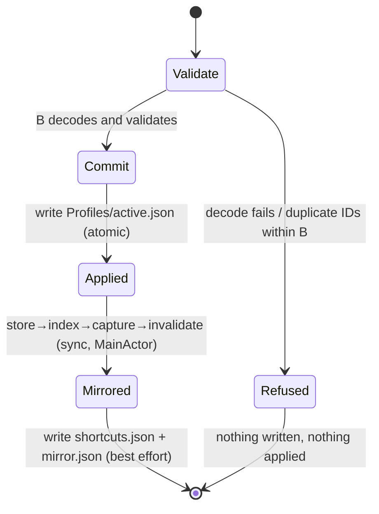

# Shortcut Profiles v1 — Design Record

- **Issue**: [#436](https://github.com/xrf9268-hue/Wink/issues/436) (design) → implemented by [#437](https://github.com/xrf9268-hue/Wink/issues/437)
- **Roadmap**: [#431](https://github.com/xrf9268-hue/Wink/issues/431)
- **Baseline reviewed**: `main` @ `419ca56`
- **Status**: design record. No behavior described here is shipped. `docs/architecture.md`
  carries this as a *planned* ownership boundary until #437 lands.

## Overview

A **Profile** is a named set of shortcut bindings. Exactly one profile is active on a
Mac at a time; switching replaces the whole live binding set atomically. Profiles are a
same-machine, same-user organizing tool ("Work" vs "Personal" vs "Presentation") — they
are not a sync mechanism, not a settings snapshot, and not a replacement for
`.winkrecipe`.

The design goal that drives every decision below: **a profile switch must be
indistinguishable, from the runtime's point of view, from the user editing their entire
shortcut list in one save.** Wink already has exactly one safe path for that
(`ShortcutManager.save(shortcuts:)`), it is already synchronous and main-actor-bound, and
it already persists before it mutates memory. v1 reuses it rather than growing a second
capture-synchronization stack.

## Goals

- Named shortcut sets with create / rename / duplicate / delete / manual switch.
- Migrate today's single `shortcuts.json` into a Default profile with **zero shortcut-ID
  churn** and no data loss.
- Transactional switching: no observable state that mixes profile A's store with profile
  B's trigger index or capture registrations.
- Crash recovery that always selects a *complete* state, never a *different* user
  configuration.
- A downgrade path that is defined and non-silent in both directions.

## Non-goals (v1)

These are excluded so that #437 cannot broaden silently. Each is a deliberate rejection,
not an oversight.

| Excluded | Why |
| --- | --- |
| TCC / permission state | Owned by macOS, keyed to the code-signing identity. A profile cannot grant or revoke it. |
| Launch at login, update settings, appearance | Device preferences; a profile that flipped them would surprise the user on every switch. |
| Hyper key mapping (`HyperKeyService`) | Global mapping with a real system side effect (`hidutil`). Per-profile remapping would churn the mapping on every switch. |
| Frontmost exception rules | Device/environment policy (VM and remote-desktop apps), not a binding set. |
| Diagnostic flags | Support tooling; must stay stable while reproducing a problem. |
| Scripts / hooks / arbitrary actions | Not in Wink's model at all; a profile is data, never code. |
| Machine-specific app paths | Already resolved at runtime by `AppBundleLocator`; storing them would break on every Mac. |
| Focus Filter automation | [#438](https://github.com/xrf9268-hue/Wink/issues/438). v1 defines the precedence contract (D12) but ships no automatic switching. |
| Profile hotkeys, display-triggered switching | No trigger surface in v1. Manual switching only. |
| Cross-profile Insights aggregation UI | D11 defines the data rules; the UI stays active-profile-scoped. |
| macOS 26-only APIs | Deployment target stays macOS 15. Every control named in D13 exists there. |

## Verified baseline

Read against `main` @ `419ca56`:

- Runtime state is one flat `[AppShortcut]` on a `@MainActor @Observable` store —
  `Sources/Wink/Services/ShortcutStore.swift:1`.
- Persistence is one file, whole-array, strict-decode, quarantine-on-failure —
  `Sources/Wink/Services/PersistenceService.swift:69` (load), `:120` (save), `:163`
  (`preserveRejectedPayload`).
- The safe apply seam persists first, replaces the store, rebuilds the index, reconfigures
  capture, invalidates the cycle session, and pushes readiness — all synchronously —
  `Sources/Wink/Services/ShortcutManager.swift:312`.
- Index construction and the availability filter —
  `Sources/Wink/Services/ShortcutManager.swift:688`–`753`.
- Usage is keyed by shortcut UUID alone; the tables' primary keys start at `shortcut_id` —
  `Sources/Wink/Services/UsageTracker.swift:679`. Delete is by UUID —
  `Sources/Wink/Services/UsageTracker.swift:208`.
- `.winkrecipe` carries **no IDs**; import mints fresh UUIDs through an injected provider —
  `Sources/Wink/Services/WinkRecipeImportPlanner.swift:110`, `:201`.
- The Search Palette trigger lives *inside* the same `[AppShortcut]` array with a sentinel
  bundle identifier — `Sources/Wink/Models/AppShortcut.swift:55`,
  `Sources/Wink/Services/ShortcutEditorState.swift:189`.
- Startup tolerates a failed load by leaving the store empty and logging —
  `Sources/Wink/AppController.swift:493`.
- `AppShortcut` decoding is deliberately lenient about *unknown* values but the file is
  loaded strictly: a decode error quarantines the whole file —
  `Sources/Wink/Models/AppShortcut.swift:196`.

Two properties of that baseline do most of the work in this design:

1. **The apply seam is synchronous and main-actor-confined.** There is no `await` between
   "store replaced" and "capture reconfigured", so "no partially applied interval" is a
   *structural* property, not a timing hope.
2. **Transfer already mints IDs.** The recipe importer never trusts a foreign UUID. Profile
   duplication is the same problem and gets the same answer (D6).

## Decisions

Each decision is stated once, with the invariant #437 must test.

### D1 — Storage layout

```text
~/Library/Application Support/Wink/
  shortcuts.json                  # compat mirror of the ACTIVE profile (derived, never truth)
  Profiles/
    manifest.json                 # schemaVersion + profile metadata list
    active.json                   # schemaVersion + activeProfileID  ← the switch commit point
    mirror.json                   # {profileID, sha256} describing the mirror as Wink last wrote it
    <profileID>.json              # [AppShortcut] — byte-compatible with today's shortcuts.json
```

Every profile — including the active one — owns exactly one data file whose name is its
UUID. A switch therefore **moves no bytes between files**; it only moves a pointer.

File-kind discrimination inside `Profiles/`: a basename that parses as a UUID is a profile
data file, anything else is metadata. This is what makes orphan detection (D9) decidable
without a second index.

**Why `active.json` is separate from `manifest.json`.** The active pointer changes on every
switch; the profile list changes only on CRUD. Putting a frequently rewritten value inside
a rarely rewritten file exposes the rare data to the frequent write's failure modes for no
benefit. Split, a crash during a switch can never damage the list of profiles.

> **Invariant.** No profile's shortcut data is ever read from, or written to, a file whose
> basename is not that profile's UUID.

### D2 — Schema and versioning

```jsonc
// Profiles/manifest.json
{
  "schemaVersion": 1,
  "profiles": [
    { "id": "…UUID…", "name": "Default", "createdAt": "2026-08-10T09:00:00Z", "modifiedAt": "…" }
  ]
}

// Profiles/active.json
{ "schemaVersion": 1, "activeProfileID": "…UUID…" }

// Profiles/<profileID>.json   — unchanged element schema
[ { "id": "…", "appName": "…", "bundleIdentifier": "…", … } ]
```

Profile **data** files keep `[AppShortcut]` exactly as `shortcuts.json` has it today,
including `AppShortcut`'s existing lenient-decode / preserve-unknown-target behavior. A
profile file written by 0.8 is readable as `shortcuts.json` by 0.7.x. That compatibility is
what makes the mirror (D3) a byte copy rather than a translation.

Metadata files decode **strictly**. `schemaVersion` greater than this build supports is a
load failure, not a best-effort read: guessing at a newer schema is how a build silently
arms a configuration its author never approved.

Metadata order in `profiles[]` is the user-visible list order and is preserved on write.

> **Invariant.** A `Profiles/<id>.json` written by this build decodes to an identical
> `[AppShortcut]` through the unmodified `PersistenceService.load()` path.

### D3 — `shortcuts.json` stays, as a derived mirror

`shortcuts.json` remains at its current path and holds a byte copy of the active profile's
data file. Wink ≥ 0.8 **never reads it as truth** — only during first-run migration (D4)
and the foreign-edit check (D5).

Two reasons, neither of which is "downgrade":

1. Everything else in the ecosystem already points at this path — the packaged-app E2E
   harness, the validation docs, support instructions, and the diagnostics bundle planned
   in [#445](https://github.com/xrf9268-hue/Wink/issues/445). Keeping it costs one small
   atomic write per save and keeps all of that working unchanged.
2. A reinstall of an older DMG is a real user action, and Wink publishes DMGs publicly.

Write order, with the important distinction that a **switch writes no profile data at all**:

| Operation | Writes, in order |
| --- | --- |
| Save (edit, import, toggle) | `Profiles/<active>.json` → mirror → `mirror.json` |
| Switch | `Profiles/active.json` → mirror → `mirror.json` |
| Create / duplicate | `Profiles/<new>.json` → `manifest.json` |
| Rename | `manifest.json` |
| Delete (of the active profile) | `Profiles/active.json` → `manifest.json` → mirror → `mirror.json` → unlink |
| Delete (of an inactive profile) | `manifest.json` → unlink |
| Import an outside edit into profile P | `Profiles/<P>.json` → mirror → `mirror.json` |

Deleting the **active** profile is a switch with an extra step, not a lighter operation: it
selects the fallback, applies it through the same runtime path a switch uses, and refreshes
the mirror and its descriptor from the fallback. Stopping after the manifest would leave
`shortcuts.json` describing the profile that was just deleted, so the E2E harness and a
downgraded build would read a configuration that no longer exists while Wink runs another
one.

Importing an outside edit writes **P's own data file**, never the active profile's — `P` is
whichever profile the mirror described, which need not be the active one. That import does
**not** switch to `P` and applies nothing to the runtime; the mirror is then rewritten from
the *still-active* profile, so the compat file keeps describing what Wink is actually
running. When `P` does happen to be the active profile, the same two writes coincide and the
adopted shortcuts are applied.

A switch only moves the pointer — D1's whole reason for giving every profile its own file.
Re-writing the target's data file during a switch would re-encode it and discard members the
model does not carry, which is the same defect D5's raw-byte rule exists to prevent.

The mirror is always written last, and its failure is logged but never fails the operation,
because a stale mirror cannot affect this build's behavior.

> **Invariant.** After any successful save or switch, `shortcuts.json` is byte-identical to
> `Profiles/<active>.json`, or a `PROFILE_TRACE_MIRROR_FAILED` diagnostic explains why not.

### D4 — Migration

Migration runs **only when `Profiles/manifest.json` is absent**, at the point where
`AppController.runStartupSequence` calls `loadShortcuts` today.

| On disk before | Result | `shortcuts.json` afterwards |
| --- | --- | --- |
| `shortcuts.json` with N shortcuts | One profile named "Default" containing all N, **same UUIDs, same order, same unknown-field bytes**; active pointer → Default | untouched by migration; rewritten as the mirror on the next save |
| No `shortcuts.json` (fresh install) | One empty profile named "Default"; active → Default | created as an empty mirror |
| `shortcuts.json` unreadable/corrupt | Existing quarantine runs unchanged (`shortcuts.load-failure-*.json` copy, source untouched); one **empty** Default profile; the existing load-failure diagnostic is surfaced | untouched — never overwritten from an empty profile |
| `Profiles/` exists but `manifest.json` absent (interrupted first migration) | Treated as "absent": migration re-runs; orphan `<uuid>.json` files are left in place and reported (D9) | as above |

Migration copies; it never deletes or rewrites `shortcuts.json`. The corrupt row is the
important one: an empty Default profile must **not** immediately mirror itself over a file
that still holds the user's (unreadable-to-us, possibly hand-repairable) data.

> **Invariant.** For every pre-migration `shortcuts.json` that loads successfully,
> `Profiles/<Default>.json` is **byte-identical to the source file**, and
> `IDs(Default profile) == IDs(shortcuts.json)` as ordered sequences.
>
> Byte equality, not a re-encode round trip: `AppShortcut.CodingKeys` omits members it does
> not model, so a migration that decoded and re-encoded would necessarily drop them — and
> "same unknown-field bytes" in the table above is exactly the promise that would break.
> Migration therefore **copies** the source bytes and only synthesizes a payload for the
> fresh-install case, where there is no source to copy.

### D5 — Downgrade and foreign edits

0.7.x writes `shortcuts.json` directly. On the next 0.8 launch, `mirror.json` no longer
describes the file on disk.

The classification answers **two independent questions, in this order**, and it is the
order that makes it total.

```text
launch (active profile = A_now, whose shortcuts are already loaded)
  └─ shortcuts.json absent → write it from A_now. Continue. (nothing on disk to lose)
     │
     ├─ Q1  IS IT CURRENT?   digest(shortcuts.json) == digest(Profiles/<A_now>.json)
     │   │                    ── raw file bytes on BOTH sides ──
     │   └─ yes → current. Repair mirror.json if it disagrees. Continue.
     │
     └─ no → Q2  DID WINK WRITE IT?   digest(shortcuts.json) == mirror.json's sha256
         ├─ no USABLE mirror.json   → UNKNOWN PROVENANCE. Leave BOTH files alone and log.
         │    (absent, unreadable, or an unsupported schemaVersion — all three
         │     mean the same thing here: nothing to compare against.)
         ├─ P is not in the manifest → UNKNOWN PROVENANCE. Leave both files alone.
         │    (the import action would have no destination, and recreating P
         │     is exactly what D9 refuses to do with an orphan.)
         ├─ digest matches          → STALE. Rewrite from A_now silently. No banner.
         └─ digest does not match    → NOT OURS. Load A_now normally, surface a
                                      non-modal banner naming P (mirror.json's profile)
                                      and BOTH possible causes:
                                        [Import into "P"]   [Keep "P" and overwrite the file]
                                      Neither side is applied without that choice.
```

**Why Q1 compares raw bytes, not a re-encoding.** A profile data file may legitimately
carry JSON members `AppShortcut` does not model — a newer build wrote it, or a user hand
edited it. Those members survive the file but not a decode/re-encode round trip, so
comparing the mirror against a re-encoded model would report a mismatch for a mirror that
is already a perfect byte copy, and the "repair" that followed would strip the preserved
members from the very file a downgrade reads, breaking the byte-preservation contract D3
and D4 depend on. The same rule governs the repair itself: it copies the profile file's
bytes and falls back to re-encoding only when that file cannot be read at all.

**Why Q1 cannot be answered by the descriptor.** `mirror.json` describes the *mirror*, not
the profile. After any crash between a data-file write and the mirror write, the mirror and
its descriptor still agree with each other while the profile has moved on — and that
happens in two different ways:

- a **switch** A → B that crashes before the mirror write leaves a mirror describing A while
  B is active; and
- an ordinary **save to the same profile** that crashes before the mirror write leaves a
  mirror describing A's previous contents while A's own data file holds the new ones.

A check that compared only descriptor-to-mirror, or only descriptor-profile to active
profile, would call both of those "current" and leave the wrong bindings in the file the
E2E harness and a downgraded build read. Comparing the mirror against the **live active
profile's bytes** catches both by construction, and reduces `mirror.json` to its one real
job: telling a file Wink wrote from a file it did not.

**Why the descriptor keeps no history — and why the banner names two causes.** D7 admits
that `Data.write(.atomic)` renames without an fsync, so under sudden power loss the
descriptor's rename can reach disk while the mirror's own rename does not. The mirror is then
one write behind, and the classification calls it "not ours".

An earlier revision of this record tried to recognize that case by having the descriptor
remember the digest it replaced. That was wrong, and the reason generalizes: a user or an
older build deliberately restoring the immediately preceding configuration produces a file
that is **byte-identical** to the one that crash leaves behind. No amount of stored history
can separate two states that are identical on disk. Accepting the previous digest would
therefore have silently overwritten a deliberate revert — precisely the guarantee this
section exists to make.

So the design does not guess. Both causes route to the same branch, which **asks**, and the
banner names both: an older version of Wink editing the file, or an unexpected shutdown. The
cost is a question the user may not have expected after a power loss; the alternative was
silently discarding a change they made on purpose. When two states cannot be told apart, the
safe wrong answer is to ask.

(Enforcing real durability ordering — `fsync` on the mirror and its directory before the
descriptor — would remove the ambiguity at the source. It is deliberately out of scope for
v1: the mirror is derived data, and buying a barrier for it would mean replacing the atomic
write on the save path with hand-rolled `FileHandle` work.)

**Why unknown provenance is left alone — and why "left alone" is not enough on its own.**
Migration deliberately skips the mirror write when the legacy `shortcuts.json` was unreadable
(D4), so that state is reachable by design. Rewriting the mirror there would destroy bytes
the user may still be able to repair by hand, and offering it as a foreign edit is worse:
those bytes do not decode, so the only available action would be "overwrite".

But leaving both files untouched only protects them until the **next ordinary save** rewrites
the mirror, and unlike every quarantine path in D8, nothing on this branch had preserved a
copy first — so an older build's edits could be lost with no trace at all. Detecting unknown
provenance therefore writes a byte-identical copy beside the original,
`shortcuts.unknown-<digest>.json`, before anything else happens. The name carries the content
digest rather than a fresh UUID, so relaunching with the same unattributable bytes rewrites
the same path with identical content instead of accumulating copies.

With that copy in place, the later save that overwrites the mirror is no longer destructive,
which is what makes "leave it alone and carry on" an honest policy rather than a deferred
data loss.

`P` is the profile the mirror last described — which is the profile the older build was
actually editing — so an adopted import lands where the user expects even if the active
profile has since changed. The transaction for that case is spelled out in D3's write-order
table: the import writes `Profiles/<P>.json`, does not switch, applies nothing to the
runtime, and then restores the mirror from the still-active profile.

Nothing is adopted or discarded automatically. This is the concrete answer to "external
switches must not silently overwrite an unsaved editor draft", applied to the other
direction: Wink must not silently overwrite the user's older-build edits either.

> **Invariant.** A `shortcuts.json` Wink cannot attribute is never auto-**imported** without
> an explicit user action, and is never **overwritten** until a byte-identical copy has been
> preserved beside it.
>
> The second clause is deliberately weaker than "never overwritten". Unknown-provenance bytes
> cannot block saves forever — Wink would be unusable — so the design buys the freedom to
> overwrite by paying for it first, with the copy. A foreign edit that *can* be attributed
> still blocks on the user's choice, because there the import action is meaningful.

### D6 — Shortcut identity

**Shortcut UUIDs are globally unique across all profiles.**

- A **switch** loads the stored array verbatim and regenerates nothing.
- **Duplicate** rewrites only each row's `id`, **inside the source file's own JSON**, and
  copies everything else byte-for-byte. Going through `AppShortcut` would drop members this
  build does not model — the same loss D4 and D5 already guard migration and mirroring
  against — so duplication is a copy, not a re-encode. A reshape failure falls back to a
  model-level copy (`isEnabled`, `frontmostBehaviorOverride`, `target`, `holdAction`, and the
  preserved-invalid-target gate) rather than refusing to duplicate at all.

> **Where preservation ends.** Unmodelled members survive every *copy* in this design —
> migration, mirroring, import, duplication — and are dropped by the first ordinary **save**
> of that profile, because a save re-encodes the model by definition. Preserving them across
> edits would require modelling them, which is precisely what a forward-compatible schema
> cannot do. State this rather than implying the guarantee is unconditional.
- **Recipe import** is unchanged: it already mints IDs, into the active profile.

The alternative — allowing IDs to repeat across profiles and widening usage identity to
`(profileID, shortcutID)` — was rejected. It forces a `usage.db` schema migration (v3 → v4)
touching every query and every date-key path, which is precisely the area that already cost
this repository two locale/identity incidents (#323, and the v2→v3 migration in
`UsageDatabaseBootstrap`). Global uniqueness buys the same unambiguity for the price of a
`UUID()` call.

Externally introduced duplicates (a hand-copied profile file, a partial backup restore) are
**detected at load and reported, not repaired and not fatal**: per-profile uniqueness is
still enforced by the existing validator, so dispatch is unaffected; only Insights
attribution merges. Silently rewriting a user's file to "fix" it would violate the
corruption-isolation rule.

One consequence must be handled explicitly, or deletion becomes destructive across
profiles:

> **Invariant.** `UsageTracker.deleteUsage(shortcutId:)` is issued only for IDs that appear
> in **no other profile**, and the check **fails closed**: if any remaining profile could not
> be read, exclusivity is unknown and no usage is deleted.
>
> Both halves are load-bearing. D8 and D9 make an unreadable or missing sibling profile
> reachable, and D6 deliberately reports cross-profile duplicate IDs rather than repairing
> them — so "not found among the profiles I could read" is not the same as "does not exist",
> and treating it as such would erase another profile's history the moment that file is
> restored. A retained usage row is a stale number in Insights; a deleted one cannot be
> recovered.

### D7 — Commit ordering and crash model

A switch to profile `B`:



The pointer is written **before** memory changes, mirroring the existing
persist-then-mutate rule in `ShortcutManager.save`. A crash therefore lands on an on-disk
state that either leads or equals what was in memory — never lags it.

**On atomicity, precisely.** `Data.write(options: .atomic)` writes a temporary file and
renames it. That guarantees *no torn file* and survives a process crash. It does **not**
guarantee cross-file ordering under sudden power loss, because rename is not an fsync.
v1 does not add explicit `fsync` barriers; instead, recovery is made **total** — every
pairwise combination of the four files has exactly one defined interpretation (D8). A
design that relied on write ordering it cannot enforce would be worse than one that can
read any combination.

> **Invariant.** For one successful switch, `rebuildIndex()` runs exactly once and
> `ShortcutCaptureCoordinator.updateShortcuts` is called exactly once. No `await` occurs
> between store replacement and capture reconfiguration.

### D8 — Recovery: every state has one reading

Recovery is defined as **three sequential stages**, not as a cross-product of file states.
A cross-product table always leaves a combination unstated — "unreadable pointer *and*
unreadable data" was exactly such a hole. Staged, every combination is covered by
construction: each stage either produces one value or terminates, and the next stage starts
from that value.

**Stage 1 — the profile list (`manifest.json`)**

| State | Behavior |
| --- | --- |
| absent | Migration (D4). Any existing `Profiles/<uuid>.json` are orphans (D9). |
| unreadable (truncated, malformed, empty profile list, duplicate profile IDs, or a `schemaVersion` this build does not support) | Preserve `manifest.load-failure-<uuid>.json`, **source untouched**. Zero shortcuts armed. Banner with the copy's path and a **Recover** action; every mutation blocked until Recover is chosen. See the Recover transaction below. |
| valid | Continue to stage 2. |

**Stage 2 — the active pointer (`active.json`), given a valid list**

| State | Behavior |
| --- | --- |
| valid and names a listed profile | That profile. Continue to stage 3. |
| valid but names an ID the list does not contain | Zero shortcuts armed + banner + explicit picker. **Never** fall through to another profile. |
| absent, or **malformed** (truncated, unparseable, missing fields), **and the list has exactly one profile** | Preserve a quarantine copy when there were bytes to preserve, then adopt the single profile and rewrite the pointer. This is a determination, not a fall-through: with one profile there is no *other* configuration the lost pointer could have named. Continue to stage 3. |
| absent, or **malformed**, **and the list has two or more** | Preserve a quarantine copy when applicable, then zero shortcuts armed + banner + explicit picker. The pointer's content is precisely what was lost, so any selection would be a guess. |
| well-formed but carrying a **`schemaVersion` this build does not support**, *any* profile count | Preserve a quarantine copy, then zero shortcuts armed + banner + explicit picker. **Never adopt, even with a single profile.** This is not corruption but a deliberate signal from another build, and a future pointer schema may mean more than "which of today's profiles" — "none active", for instance. Adopting would arm bindings that build left unarmed, which is exactly the guessing D2 forbids. |

**Stage 3 — that profile's data file, given a resolved profile**

| State | Behavior |
| --- | --- |
| valid | Normal load. |
| unreadable (malformed, or duplicate shortcut IDs — the existing `PersistenceService` rules, unchanged) | Preserve a quarantine copy, source untouched. The profile is marked *unreadable* in the UI. Zero shortcuts armed. Banner offering to switch to a readable profile — as an explicit action. |
| absent | As above, minus the quarantine copy. **Plus:** if a legacy `shortcuts.json` still parses, offer it as an import into this profile. Under the same no-fsync model, `manifest.json` can land while the Default profile's data file does not, and migration never re-runs once a manifest exists — without this the intact legacy file would sit on disk with nothing pointing at it. Offered, never adopted automatically. |

**The Recover transaction.** Recover must produce a configuration the three stages can
actually load, so it writes all three files, in this order:

1. `Profiles/<new>.json` — an empty shortcut array
2. `Profiles/manifest.json` — one Default profile naming that id
3. `Profiles/active.json` — pointing at it

Writing only the manifest would leave a stale `active.json` naming an id the new manifest does
not contain, and stage 2 would return the user straight back to the zero-armed picker; writing
manifest and pointer without the data file would pass stages 1 and 2 and then fail stage 3.
Overwriting the damaged manifest is safe because a byte-identical copy was preserved before the
banner appeared, and Recover re-attempts that preservation first in case the earlier attempt
failed.

Because the stages compose, a doubly damaged install has exactly one reading with no extra
rule: an unreadable pointer with a single profile resolves in stage 2 (adopt), and if that
profile's data is *also* unreadable, stage 3 quarantines it and arms nothing.


The rule the stages encode: **an unreadable configuration yields no shortcuts, never a
different user's-eye configuration.** Arming another profile's chords because this one
failed to load is the single worst outcome available — the user's muscle memory would fire
bindings they did not choose.

"Zero shortcuts armed" is not a new severity. It is exactly what shipped Wink already does
when `shortcuts.json` fails to load (`AppController.runStartupSequence` logs and leaves the
store empty). v1 keeps that policy and adds the banner and the recovery action it currently
lacks.

### D9 — Orphans and stale references

- Manifest entry with no data file → entry kept, marked *unreadable*, reported. Never
  removed automatically; the file may be restorable.
- `Profiles/<uuid>.json` with no manifest entry → **orphan**. Ignored, never auto-imported,
  reported once per launch as `PROFILE_TRACE_ORPHAN id=<uuid>`. An orphan may be a
  preserved copy or an interrupted create; adopting it would be guessing.
- Diagnostics (#445) list orphans and unreadable profiles so support can act on facts.

### D10 — Runtime apply contract

The switch runs entirely inside `ShortcutManager`, reusing the `save(shortcuts:)` body with
a different persistence target:

1. Load and validate `B` (decode + per-profile unique IDs). Failure → refuse, apply nothing.
2. `inputMonitoringWasRequired = captureCoordinator.inputMonitoringRequired`.
3. Commit `active.json`.
4. `shortcutStore.replaceAll(with: B)`.
5. `rebuildIndex()` — **once**.
6. `handleCaptureConfigurationChange(inputMonitoringWasRequired:)` — **once**.
7. `appSwitcher.invalidateWindowCycleSession(reason: "profile_switched")`.
8. `holdGestureArbiter?.reset()`; dismiss the window picker and the search palette if
   presented; clear `interactivePanelSessionActive`.
9. `notifyCaptureStatusChangeIfNeeded()`.
10. Mirror + `mirror.json` (best effort).

Steps 4–9 are the same synchronous main-actor block `save()` already runs, in the same
order, which is why the profile switch inherits its proven properties instead of restating
them. Standard, Fn+F-row, and Hyper routes are re-derived by the existing coordinator from
the new set; Hyper enablement itself is global and untouched (Non-goals).

> **Invariant.** At no point observable from the main actor do `ShortcutStore.shortcuts`
> and `triggerIndex` come from different profiles.

### D11 — Insights and usage

- Usage rows stay keyed by the globally unique shortcut UUID. **No `usage.db` schema
  change.**
- The per-shortcut Insights list is scoped to the **active** profile, because it renders
  names from the live store. Device-wide metrics (app activations, totals) stay device-wide
  and are explicitly *not* profile-scoped — labelled as such in the UI.
- "Moving" a shortcut between profiles is delete-here + create-there, so it starts a new
  history. This is an accepted, documented consequence of D6, not a bug: the alternative was
  a usage-schema migration.
- Deleting a profile deletes usage only for the IDs it exclusively owns (D6), and the
  delete confirmation says so.

### D12 — Manual vs. future automatic switching

v1 ships manual switching only. It nonetheless fixes the precedence contract now, so #438
cannot invent one later:

- A **manual** switch sets `manualOverride = (profileID, timestamp)` and always wins.
- An **automatic** (Focus-selected) switch is applied only when no manual override is in
  effect for the current Focus session. Leaving the Focus mode clears the automatic
  selection and restores the profile that was active before it — never a third profile.
- `canApplyExternalSwitch` is `false` while a recorder session or a pending recipe-import
  preview is live (D14). Automatic switches **defer**; they never cancel user drafts.
- v1 implements the seam and returns `false`/no-op for the automatic case. #438 supplies
  the trigger only.

### D13 — CRUD rules

| Rule | Value |
| --- | --- |
| Name length | 1–64 characters after trimming whitespace and newlines |
| Name uniqueness | Required, case-insensitive over NFC-normalized names. Menus and future automation address profiles by name; ambiguous names would make both unusable. Collisions are rejected inline, never auto-suffixed on rename. |
| Profile count cap | 32. Keeps the switch menu usable and the manifest small; far above any plausible use. |
| Create | Two entry points: **Duplicate current** (default) and **New empty profile**. Duplicate mints IDs per D6 and names it `<name> copy`, `<name> copy 2`, … |
| Rename | Metadata-only write. No data file touched, no IDs touched. |
| Delete | Allowed only while ≥2 profiles exist. Confirmation names the profile and states that its shortcuts and their exclusively-owned usage history are removed. |
| Delete the active profile | The active pointer moves to the **preceding entry in manifest order**, or to the first entry if the deleted one was first. Deterministic and matches the visible list; `modifiedAt` was rejected because ties are possible. The fallback is then applied through the same runtime path as a switch, and the mirror is refreshed from it (D3). If the manifest write fails after the pointer was committed, the pointer and the in-process locator are rolled back so the failure is total — a half-applied delete would keep the runtime on the deleted profile while saves landed in the fallback's file. **If that rollback write also fails** — the same full or read-only volume fails both — the switch is *accepted* instead: memory is aligned with the durable pointer, the fallback is applied to the runtime, and the user is told the delete failed and which profile they are now on. Claiming a rollback that did not happen would be contradicted by the next relaunch, and a locator disagreeing with `active.json` is what makes the next save overwrite the wrong file. |
| Empty profile | Legal and fully supported. Zero armed chords is a valid configuration ("Presentation"), and the existing `emitCaptureBlockedDiagnostics` already stays silent at zero counts, so nothing reports it as an error. |

### D14 — In-flight sessions and editor conflicts

| In flight when a switch is requested | Manual switch | Automatic switch (#438) |
| --- | --- | --- |
| Composer draft (`selectedApp` + `recordedShortcut`) | Discarded, draft cleared, switch proceeds. The user initiated it. | Deferred |
| Live recorder (`isRecordingShortcut` / `isRecordingSearchPaletteShortcut`) | Cancelled first — both flags false, which releases the #417/#419 dispatch gate — then switch | Deferred |
| Pending recipe import preview | **Discarded**, with an explicit non-modal message in the Shortcuts tab. Applying a plan whose conflicts and IDs were computed against profile A onto profile B would be plainly wrong, so discarding is the only correct behavior; the requirement is only that it not be silent. | Deferred |
| Window picker / search palette presented | Dismissed as part of step 8 | Deferred |
| Hold gesture mid-flight | `holdGestureArbiter.reset()` — a gesture must not resolve into a tap or hold across the boundary, the same rule the pause transition already applies | Deferred |
| Window cycle session | Invalidated with `reason: "profile_switched"` | Deferred |
| Toggle session in flight | Left alone. It is a pid-scoped activation already in progress and is not a binding; killing it would strand a half-activated app. | Same |

### D15 — Search Palette trigger is per-profile

**Decision: the Search Palette trigger stays inside the profile's `[AppShortcut]` array and
is therefore per-profile.** #436 set the default expectation the other way ("a global device
preference") and invited a better migration-safe model; this is it.

The counter-argument in the code is real but narrower than it looks. The comment at
`ShortcutEditorState.swift:412` calls the palette trigger "a local device preference (like
Hyper Key enablement or the frontmost-exceptions list)" — but that comment governs
`.winkrecipe` **export**, and its stated reason is portability *to other people and other
Macs*. Profiles are same-machine, same-user. The reasoning does not transfer.

What does transfer is cost:

- **Per-profile (chosen):** no element-schema change, migration is a whole-array move,
  the palette row keeps participating in `ShortcutValidator` and the trigger index with
  zero new plumbing, and `.winkrecipe` still excludes it via the untouched
  `exportableShortcuts` filter.
- **Hoisted to a global slot (rejected):** the row must be injected back into the array the
  trigger index is built from, so `ShortcutStore.shortcuts` would contain a row that is not
  in the active profile and `save()` would have to split it out again on every write. That
  is a new leak-or-drop bug class on the hot configuration path, in exchange for one
  convenience.

The one real cost — a brand-new empty profile has no palette trigger — is absorbed by D13
making **Duplicate current** the default way to create a profile.

## Failure scenarios

| # | Scenario | Behavior |
| --- | --- | --- |
| F1 | Crash after `active.json`, before memory apply | Next launch loads B. Consistent; the pointer led memory by design. |
| F2 | Crash after memory apply, before mirror write | Active = B; `shortcuts.json` and `mirror.json` both still describe A. Q1 fails (the mirror is not the live profile's bytes), Q2 passes (Wink wrote it) → *stale*, rewritten silently, no banner. |
| F2b | Crash after a **same-profile** save, before mirror write | Identical shape: the mirror still describes A's previous contents while A's data file holds the new ones. Same Q1/Q2 outcome — which is why Q1 compares against the live profile rather than against the descriptor's profile. |
| F2c | Power loss between the mirror rename and the descriptor rename | The descriptor advertises a digest the mirror never received. Indistinguishable on disk from a deliberate restore, so the banner asks and names both causes rather than repairing silently. |
| F2d | Power loss during first-run migration, manifest landed, data did not | Stage 3 finds no data file, offers the intact legacy `shortcuts.json` as an import, and arms nothing until the user chooses. |
| F2e | Delete of the active profile fails, and so does its rollback | The pointer durably names the fallback. The switch is accepted, applied, and reported; the delete is reported as failed. No divergence between memory, disk, and what the user was told. |
| F3 | Disk full during profile-data write | Atomic write fails → save/switch throws → in-memory state untouched → `saveErrorMessage` surfaced. Same shape as today's write-failure path. |
| F4 | Disk full during mirror write | Logged as `PROFILE_TRACE_MIRROR_FAILED`. Switch already succeeded and stays succeeded. |
| F5 | `manifest.json` truncated by an external tool | D8 row 2: quarantine copy, source untouched, banner + Recover, mutations blocked. |
| F6 | Active profile file holds duplicate IDs | Existing duplicate-ID load failure fires. Quarantine copy, zero shortcuts armed, banner. Never partially loaded. |
| F7 | Two profiles share a shortcut ID | Reported, non-fatal. Dispatch unaffected; Insights merges those rows. `deleteUsage` suppressed for that ID (D6). |
| F8 | User downgrades to 0.7.x, edits, upgrades | D5 foreign-edit banner with an explicit two-way choice. |
| F9 | Profile deleted while its data file is open elsewhere | Manifest entry and pointer are updated first; a failed data-file unlink leaves an orphan (D9), reported, never resurrected. |
| F10 | 32-profile cap reached | Create/Duplicate disabled with an explanatory label. No silent no-op. |
| F11 | Switch requested to the already-active profile | No-op: no write, no rebuild, no invalidation. Guarded like `setRecordingSessionActive`'s same-value early return. |
| F12 | Application Support directory unavailable | `StoragePaths.appSupportDirectory()` already returns `nil`; the profile store reports unavailable, the app runs read-only in memory with a banner, exactly as persistence does today. |

## UI and terminology

**Terminology, fixed:**

- **Profile** — one of *your* shortcut sets on *this* Mac. Only one is live at a time.
- **Recipe** (`.winkrecipe`) — a file for sharing bindings with other people or other Macs.
  Importing a recipe imports **into the active profile**; the Manage sheet says so.

The two words must never be used for each other in UI strings, docs, or the guide.

**Settings → Shortcuts**, above the list:

```text
┌──────────────────────────────────────────────────────────────┐
│  Profile  [ Work                    ⌄ ]     [ Manage… ]      │
│           ├ Default                                          │
│           ├ ✓ Work                                           │
│           └ Presentation                                     │
├──────────────────────────────────────────────────────────────┤
│  ⌥⌘1  Safari                                     ⌄  ⋯        │
│  ⌥⌘2  Terminal                                   ⌄  ⋯        │
└──────────────────────────────────────────────────────────────┘
```

**Manage Profiles** sheet — a `List` plus a small toolbar:

```text
┌─ Manage Profiles ────────────────────────────────────────────┐
│  Default          3 shortcuts                                │
│  Work             11 shortcuts            ← active           │
│  Presentation     0 shortcuts                                │
│  Archive (2024)   ⚠ can't be read                            │
│                                                              │
│  [＋ ⌄]  [Rename]  [Delete]              ＋ ⌄ = Duplicate…    │
│                                              New empty…      │
│  Recipes import into the active profile.                     │
└──────────────────────────────────────────────────────────────┘
```

**Menu bar popover**: one row showing the active profile name, opening the same switch list.

Accessibility and localization:

- Every control reachable and operable by keyboard; the sheet supports Escape to dismiss and
  Return to confirm the focused destructive action only after its confirmation step.
- VoiceOver: the picker is labelled "Profile", each row announces name + shortcut count +
  active state; the unreadable badge has a text label, never colour alone.
- All new strings go through `Localizable.xcstrings` with English keys and zh-Hans
  translations, per `docs/localization.md`. Profile **names** are user data and are never
  localized, never used as identifiers, and never used to build notification identifiers or
  persistence keys (#323 rule).
- Controls used: `Picker`, `List`, `.sheet`, `.confirmationDialog` — all macOS 15.

## Diagnostics

New `PROFILE_TRACE_*` lines, following the existing `SHORTCUT_TRACE_*` / `TOGGLE_TRACE_*`
convention (locale-stable tokens, never localized text):

| Token | Emitted when |
| --- | --- |
| `PROFILE_TRACE_SWITCH from=<id> to=<id> shortcuts=<n>` | A switch commits |
| `PROFILE_TRACE_SWITCH_REFUSED to=<id> reason=<token>` | Validation refused a switch |
| `PROFILE_TRACE_MIGRATED shortcuts=<n> source=<path>` | D4 ran |
| `PROFILE_TRACE_MIRROR_FAILED reason=<token>` | Mirror write failed |
| `PROFILE_TRACE_FOREIGN_MIRROR profile=<id>` | D5 digest mismatch |
| `PROFILE_TRACE_ORPHAN id=<uuid>` | D9 orphan found |
| `PROFILE_TRACE_DUPLICATE_ID id=<uuid> profiles=<id>,<id>` | D6 cross-profile duplicate |
| `PROFILE_TRACE_UNREADABLE id=<uuid> preservedCopyPath=<path\|none>` | Data file quarantined |

## Verification matrix

Rows marked **runtime** cannot be proven by `swift test` and belong to #437's exact-head
packaged-app validation.

| # | Proves | How |
| --- | --- | --- |
| V1 | Migration preserves IDs, order, and bytes | Fixtures including one with an **unmodelled JSON member** → migrate → assert ordered ID equality and byte equality between the source and the migrated profile file |
| V2 | Corrupt source is not clobbered | Corrupt fixture → migrate → assert empty Default, source bytes unchanged, quarantine copy exists |
| V3 | Switch is atomic in memory | Instrumented `ShortcutCaptureCoordinator` records `(store, index)` pairs; assert no mixed pair, and exactly one `updateShortcuts` call |
| V4 | Exactly-once rebuild | Counting fake asserts `rebuildIndex` == 1 per successful switch, 0 per refused switch |
| V5 | Every recovery state | Table-driven over each stage of D8 **and** their compositions (unreadable pointer with unreadable data, etc.); assert armed-shortcut count and that no *other* profile ever loads |
| V6 | Crash points | Inject failure after each of the four writes; assert the resulting on-disk state maps to exactly one D8 row |
| V7 | Duplicate mints IDs and preserves bytes | Duplicate a profile whose file carries an **unmodelled JSON member**; assert ID sets are disjoint, the member survives in the copy, and every modelled field is equal including preserved invalid targets |
| V8 | Usage is not cross-deleted | Same ID in two profiles → delete in one → assert the other's rows survive and `deleteUsage` was not issued |
| V8b | Exclusivity fails closed | Make a remaining profile unreadable → delete another profile → assert **no** usage deletion is issued, for any ID |
| V9 | Editor conflicts | Switch during recorder / composer draft / pending import; assert D14's row-by-row outcome |
| V10 | Foreign-edit detection | Rewrite `shortcuts.json` out of band → relaunch → assert banner state and that nothing was written until a choice was made |
| V10b | Stale mirror is not mistaken for a foreign edit | Fail the mirror write during a switch **and** during a same-profile save → relaunch each → assert the mirror is rewritten from the live profile with **no** banner |
| V10c | Unknown provenance is left alone | Migrate from an unreadable legacy file → relaunch → assert no banner, and that `shortcuts.json` still holds the user's original bytes |
| V10d | Unmodelled members survive | Profile file with an extra JSON member, mirror a byte copy → relaunch → assert no stale rewrite and that the member is still present in both files |
| V11b | Unsupported pointer schema fails closed | Well-formed `active.json` with `schemaVersion` 99 and exactly one profile → assert zero armed, a quarantine copy, and an explicit picker |
| V10e | One-behind mirror asks rather than overwriting | Let the mirror write report success while writing nothing, so the descriptor advances alone → relaunch → assert the banner appears and the file is untouched. (Failing the write instead does *not* reproduce this: a reported failure skips the descriptor and leaves the pair consistent, which is the separate silent-repair case.) |
| V10g | Interrupted migration is resumable | Manifest present, Default data file absent, legacy `shortcuts.json` intact → assert zero armed **and** an offered import |
| V10f | Dangling descriptor is unknown provenance | Descriptor naming a deleted profile, mirror changed out of band → assert no banner and no import action offered |
| V11 | Name and cap rules | Empty, 65-char, case-differing duplicate, 33rd profile — all rejected with a message |
| V12 | Delete-active fallback | Delete active at list positions first/middle/last; assert the deterministic successor, that the fallback is applied to the runtime, and that the mirror now describes it |
| V12b | Delete-active failure is total | Fail the manifest write after the pointer commit; assert the throw, and that the pointer, locator, and a fresh load all still name the original profile |
| V12c | A failed rollback is not claimed as one | Fail the manifest write **and** the rollback write; assert the outcome reports the forced switch, the locator names the fallback, and a fresh load agrees with the message shown |
| V13b | Unattributable bytes are preserved | Reach unknown provenance twice; assert exactly one `shortcuts.unknown-*.json` copy exists and holds the original bytes |
| V13 | Palette per-profile | Profile A has a palette trigger, B does not; switch A→B→A; assert trigger index membership follows and no ID churn |
| V14 | **runtime** Live switch with real capture | Packaged app, standard + Hyper bindings live: switch, assert old chords stop and new chords fire; record SHA, bundle path, executable SHA-256, registrations/readiness, activation evidence |
| V15 | **runtime** Switch under a live Hyper hold / picker | Switch while the picker is open; assert dismissal with no stray toggle |
| V16 | **runtime** Relaunch after switch | Switch, quit, relaunch; assert the same profile is active and armed |

## Test plan for migration and recovery

Ordered so that #437 cannot start implementation without the harness that catches the
expensive mistakes first:

1. **Fixture corpus** under `Tests/WinkTests/Fixtures/profiles/`: v0.7 single-file installs
   (empty / typical / with a palette trigger / with an unknown `target` value / with a
   duplicate ID), plus malformed manifest, malformed `active.json`, missing data file,
   orphan data file, and cross-profile duplicate IDs.
2. **Injected-failure store**: a `ProfileStore` seam whose write closure can fail at each of
   the four write points, so V6 enumerates crash points without process kills.
3. **Recovery table test** (V5) written *before* the store, from D8 verbatim — the table is
   the specification.
4. Only then the runtime apply contract tests (V3, V4), which need the real
   `ShortcutManager` and the existing fake coordinator.
5. Runtime items (V14–V16) batched into the repository's macOS validation flow under the
   `macOS runtime validation pending` label.

## Rejected alternatives

| Alternative | Why rejected |
| --- | --- |
| One `profiles.json` holding all profiles and their shortcuts | Every edit rewrites every profile's data. One corrupt write loses all profiles instead of one, and the file grows without bound in the hot save path. |
| `shortcuts.json` *is* the active profile; only inactive profiles get files | A switch must move bytes between two files with two commit points. A crash between them leaves the pointer naming A while the file holds B — exactly the "silently loading a different configuration" failure the issue forbids. |
| Active pointer inside `manifest.json` | Couples the frequently rewritten value to the rarely rewritten profile list; a crash during a switch could damage the list. |
| Drop `shortcuts.json` entirely | Breaks the E2E harness, the validation docs, the planned diagnostics bundle, and every support instruction, and makes downgrade silently lossy. |
| Adopt foreign `shortcuts.json` edits automatically | Silent overwrite in the other direction. D5 asks instead. |
| Per-profile shortcut IDs + `(profileID, shortcutID)` usage identity | Forces a `usage.db` v3 → v4 migration across every query and date-key path — the exact area of two prior incidents — to buy nothing the mint-on-duplicate rule doesn't. |
| Search Palette trigger hoisted to a device-global slot | Requires injecting a non-profile row into the array the trigger index is built from and splitting it out on every save: a new leak-or-drop bug class on the configuration path (D15). |
| Profiles snapshot Hyper mapping / exceptions / launch-at-login | Turns every switch into a system-wide side effect (`hidutil`, `SMAppService`) and makes a profile a settings snapshot, which #436 explicitly forbids. |
| Auto-switch to another profile when the active one is unreadable | Arms chords the user did not choose. The worst available outcome; D8 chooses zero-armed instead. |
| Auto-repair cross-profile duplicate IDs by minting | Rewrites a user file without consent, violating corruption isolation. Reported instead (D6). |
| Names as identifiers (no UUID) | Rename would orphan every reference, and #438 needs a stable handle across renames. |

## License boundary

Thaw ([GPL-3.0](https://github.com/thaw-app/Thaw/blob/bf6e34394611d6aff8a603d786dc8835e94f0d06/LICENSE))
was read as a *behavioral* reference only, to confirm that a profile manager needs a
manifest plus a staged apply. No Thaw source, asset, test, corpus, or workflow is copied or
adapted. Every mechanism above is derived from Wink's own existing seams — the
persist-then-mutate save path, the quarantine-and-preserve loader, the mint-on-import
recipe planner — and must be implemented clean-room.
